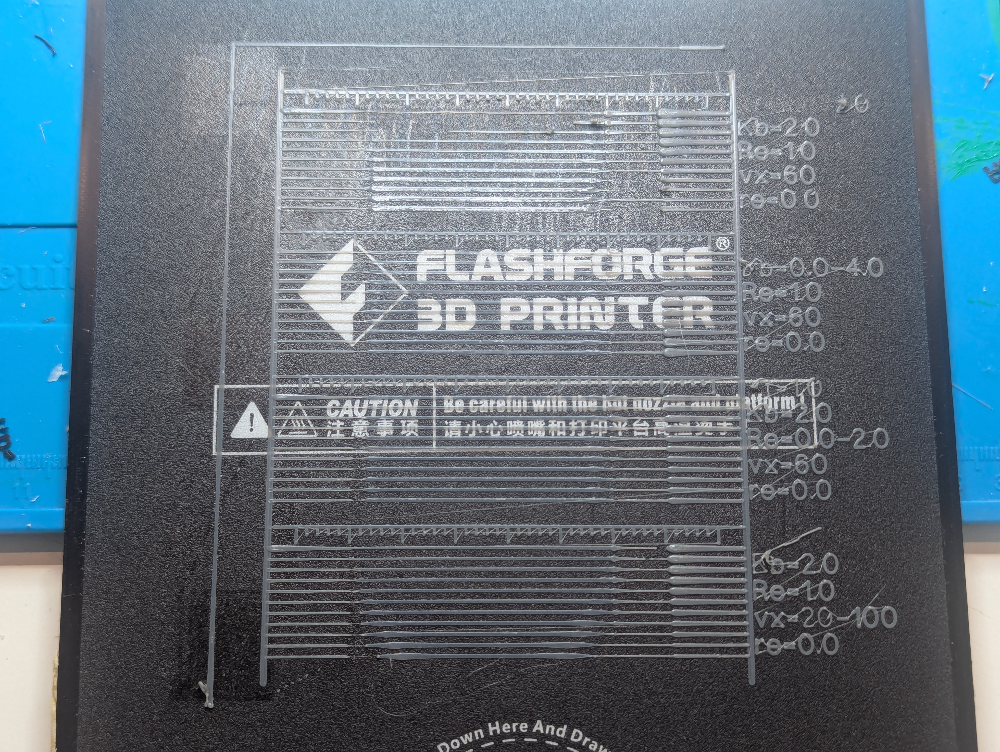

# Printer calibration and Control

## Printer characteristics.

Low end printers like my Flashforge Adventurer 3 have X and Y speeds up to
100mm/s and acceleration of about 500mm/s^2.

A printer with 500mm/s^2 acceleration can go from 0 to 100mm/s in 0.2s over
10mm of distance. For 0 to 60mm/s it is 0.12s over 3.6mm of distance.

Note that diameter 0.4mm nozzle vs 1.75mm filament means that extruding
`de=1mm` of filament translates to nearly 20mm of nozzle thread. For layer
`h=0.2mm` with line `w=0.4mm` for 0.2x0.4mm line areas, `de=1mm` is 30mm of
printed line. For layer 0.1x0.4mm lines lines it is 60mm, and for 0.3x0.4mm
it's 20mm. So line print velocity `vl` is between 20x to 60x, or typically
30x, extruder velocity `ve`.

## Linear Advance

Linear Advance or Pressure Advance is mm of extrusion advance per mm/s of
filament extrusion speed, and has typical values in the range 0.0-2.0. Note
that 100mm/s print speed for a 0.3x0.4 lines using 1.75mm diameter filament is
12mm^3/s or 5mm/s filament rate. This suggests the advance could get as high
as 10mm, or 200mm of line!

This means 5mm of uncompensated pressure advance translates to more 100mm of
line smear or stringing.

Linear advance assumes flow rate out the nozzle is linear with pressure, and
pressure is linear with `pe` extrusion advance of filament (how many mm of
filament the extruder has pushed that has not yet come out the nozzle and is
compressed filament). This is based on assuming the filament and boden tube
between the extruder and nozzle behaves like a spring with force linear with
compression distance as per [Hooke's
law](https://en.wikipedia.org/wiki/Hooke%27s_law), and nozzle flow rate is
linear with pressure in the nozzle as per [Poiseuille's
law)(https://en.wikipedia.org/wiki/Poiseuille_law). The filament force divided
by filament cross-section area (nozzle input area) is the pressure in the
nozzle, so nozzle flow is linear with filament compression distance, or the
extruder advance distance. See this for some thoughts on these assumptions;

https://klipper.discourse.group/t/modification-of-pressure-advance-for-high-speed-bowden-printers/13053/18?u=dbaarda

Note the linear advance factor `Kf` for compensating for this is the mm of
advance `pe` needed per mm/sec of extruder velocity for the nozzle output flow
rate to match the extruder velocity.

```python
  pe = Kf * de/dt
```

Where

```
  de/dt is the extruder velocity in mm of filament/sec.
  Kf is the linear advance factor in mm per mm/sec of extruder velocity.
  pe is the mm of filament linear advance "pressure" distance.
```

Note that at the steady state, the filament rate into the nozzle `de/dt`
equals the filament rate out of the nozzle `dn/dt`. This means you can replace
`de/dt` with `dn/dt` in the above equation and get the flow rate out of the
nozzle as a function of advance `pe`;

```python
  pe = Kf * dn/dt
  dn/dt = pe/Kf
```

The rate of change in `pe` is `dpe/dt` and is equal to the flow rate in the
extruder minus the flow rate out the nozzle;

```python
  dpe/dt = de/dt - dn/dt
        = de/dt - pe/Kf
```

Which gives us the change in `pe` of `dpe` over time `dt`;

```python
  dpe = de - pe * dt/Kf
```

Note that this is an exponential decay equation, with `pe` advance
exponentially approaching the steady state value for a fixed `de/dt` rate with
a timeconstant of `Kf`. Exponential decay processes cause both lag and a
low-pass-filter "frequency cutoff" effects that depends on the timeconstant.

The lag effect means that changes in the extruder input rate will take roughly
`Kf` time in seconds to appear at the nozzle output. More specifically if you
drive the extruder velocity with a sin-wave, the peaks and troughs in the
sin-wave nozzle output will be exactly `Kf' seconds behind the peaks and
troughs in the sin-wave input.

The low-pass-filter "frequency cutoff" effect means that for a sin-wave
extruder input with amplitude `Ae`, if the frequency `fe` is higher than
`fc=1/(2*pi*Kf)`, then the nozzle output amplitude `Az` will be reduced by
`Az=(fc/fe)*Ae`. This roughly means changes in extruder speed that happen
every 2x faster than every `pi*Kf` seconds will only get half way to the max
and min target nozzle output rates (but note those output peaks and troughs
will also lag by `Kf` seconds).

So for `Kf=1.0` it will take about 1 seconds of extruding before the extrusion
rate "catches up" and is extruding at about the right rate, and switching
speeds faster than every 1.5sec will mean it only gets about half way there.
At 100mm/s, 1 seconds is 100mm worth of line. Note that also means 100mm of
track ooze you would get if you keep moving without retracting after you stop
extruding a line at 100mm/s.

So the pressure can take some time to build up enough for the right extrusion
rate when extruding lines at constant velocity. It also can take some time to
decay back enough when you change to a lower extrusion velocity.

Printers that implement linear advance dynamically adjust the extrusion rates
to take this into account, effectively compensating for the lag and frequency
cutoff effects by adjusting extrusion rates in advance. See the following for
how it's implemented;

https://mmone.github.io/klipper/Kinematics.html

## Retract and Restore

Retraction withdraws the extruder when you stop extruding, and restore
advances it again before you start extruding. This helps avoid stringing when
moving between extrusions. The idea is that retraction sucks the filament back
into the nozzle to prevent "drool", and restore pushes it back to the tip of
the nozzle again. There are lots of calibration tests to help you figure out
the right amount of retraction to minimize stringing.

However, when you look at Linear Advance works and how the nozzle output rate
varies with pressure, it becomes pretty clear that what retraction actually
does is relieve the accumulated advance pressure, and even more importantly,
restore re-applys that pressure! This means when you print at constant speed,
the advance pressure initially starts low giving under-extruded lines, but
builds up over the `Kf` timeconstant duration to give the right extrusion
rate. When the printer stops and retracts, it quickly relieves that pressure
so it can move without extruding, and when it restores, it re-applys that
pressure so the printer is ready to print at the previous speed without
under-extruding at the start.

What this means is the ideal retraction distance is the accumulated pressure
advance distance. If the printer implements linear advance, and it is
implemented and tuned perfectly, this means you shouldn't need any retraction
or restore at all, but perhaps a tiny token amount to compensate for tiny
miss-calibration errors and backlash would be wise. However, if the printer
doesn't implement linear advance, then the ideal retraction distance depends
on the previous extrusion speed, and the ideal restore distance depends on the
**next** extrusion speed.

If the printer always printed at constant extrusion rates, using a constant
sufficiently large retraction would be fine, since the pressure to releave and
reapply would be the same. However, slicers don't use constant extrusion
rates, they slow down for outer edges and corners. Also printers cannot
instantaneously reach the requested line-speed, and have to accelerate and
decelerate, adjusting extrusion rates along the way.

I have been battling under/over extrusion problems and retraction tuning for a
print that has quite a lot of speed variation due to having a large base (fast
print) with small raised clips (slow print). The small clips had lots of
stringing and over extrusion for the layers that also included large base
areas, but the clips were fine for the higher layers without the large base
areas. No amount of tuning retraction and extrusion rates could fix this.
These pressure advance affects totally explain why.

It should be possible to implement linear advance in gcode for printers that
don't implement it in firmware. It would involve dynamically adjusting
retraction/restore distances and explicitly inserting
acceleration/deceleration line-segments with extrusion rates adjusted to
build/decay the linear advance amount.

Even without implementing full linear-advance including acceleration in gcode,
it would probably be worth implementing dynamic retract/restore based on the
previous/next extrusion rates. This would probably fix my clip print.

## Print Layer BackPressure

After playing around with trying to figure out the `Kf` value for my Adv3
printer, it's become apparent that the simple linear advance model is
insufficient to accurately reflect the real nozzle flow characteristics. It
seems the relationship between nozzle flow rate and advance pressure is not
linear. This is also discussed in various places online like;

https://klipper.discourse.group/t/modification-of-pressure-advance-for-high-speed-bowden-printers/13053/26

The reported experiences vary, with some reporting `Kf` seems to drop with
increasing velocity, and others that it increases. In the speed ranges
possible with the Adv3 it seems `Kf` drops with increasing velocity.

After much fiddling around and experimenting, I've formed a theory that this
is because extruding against the print surface generates back pressure. The
nozzle is extruding into a bead of cooling filament that is pressed against
the print surface. Below a certain pressure threshold it cannot push past that
bead and the flow is effectively zero. So what actually drives the flow rate
at low pressures is nozzle movement, moving away from the flow-blocking bead.
At a constant head speed and with sufficient feed rate it will draw a pretty
consistent line, with the bead smearing behind he nozzle. The advance pressure
doesn’t make much difference because the flow rate is dominated by the
back-pressure and nozzle speed moving away from that back-pressure.

At higher nozzle speeds and flow rates, the pressure for the flow rate through
the nozzle starts to dominate. I suspect the back-pressure might be pretty
constant at any speed for a given material, layer height, track width, and
extrusion ratio, because the smearing bead shape will be pretty much the same
for the same track shape regardless of the speed. It might drop a bit as speed
increases because the smearing bead has less time to cool and will flow
better, but i’m not sure how much difference that would make. I don’t think
the bead cools much under the nozzle at even super slow speeds. that is
relieved by moving the print head, smearing the bead away. This would explain
why `Kf` appears to decrease with velocity.

At even higher speeds I suspect the linear [Poiseuille's
equation](https://en.wikipedia.org/wiki/Hagen%E2%80%93Poiseuille_equation)
assumption starts to fail and [Bernoulli’s
equation](https://en.wikipedia.org/wiki/Bernoulli%27s_principle) with pressure
as a function of velocity squared starts to dominate, which could explain why
some people are seeing `Kf` increase with velocity.

We will assume the back-pressure is a function of only the bead diameter,
which is the track width (and extrusion ratio), and is independent of the
nozzle velocity. Note this could be very wrong, with faster speeds giving the
bead less time to cool and harden, lowering the back-pressure, but we assume
this for now. We also assume that the back-pressure for a given material and
layer height is a linear function of the bead diameter. I could, and have,
invent all sorts of rationalizations for this assumption but I'm basicly
making stuff up so I won't include it here. We'll assume this for simplicity
for now.

The flow through the nozzle also requires pressure. Although I suspect that
this should be Bernoulli’s equation, the existing PA model assumes
Poiseuille’s equation, so for now we will too.

This gives us;

```python
  Pe = Pn + Pb      # (1) total extruder advance pressure.
  Pn = Kf*vn        # (2) nozzle pressure from flow rate.
  Pb = Kb*Db        # (3) back pressure from extruded bead.
  vn = v*Db*h/Af    # (4) nozzle flow velocity.
  Db = r*w          # (5) extruded bead diameter.
  Af = pi*(Df/2)^2  # (6) cross section area of filament.
```

Where:

```
  Pe is the extruder pressure in mm of filament advance.
  Pn is the nozzle flow pressure in mm of filament advance.
  Pb is the bead back-pressure in mm of filament advance.
  Kf is the nozzle pressure factor.
  Kb is the bead backpressure factor.
  vn is the nozzle outflow velocity in mm/s of filament.
  ve is the extruder velocity in mm/s of filament.
  Df is the filament diameter in mm.
  Db is the bead diameter in mm.
  Af is the filament cross-section area in mm^2.
  r is the extrusion ratio.
  w is the nominal line width in mm.
  h is the layer and line height in mm.
  v is the nozzle velocity in mm/s
```

Note for a constant track width at steady state where extruder velocity `ve`
equals nozzle flow velocity `nv` we get;

```python
  Pe = Kf*ve + Cf
  Cf = Kb*Db
```

This is a Linear Advance model with a constant offset that depends on the line
width (and material, and nozzle temp, and ...), which so far appears to match
what I've seen.

Note in earlier work on this I included a `Cb` constant offset for the
backpressure, but I've adbandoned it because it makes no difference to, and is
impossible to distinguish from, additional `Re` retraction.

To validate and calibrate this model we need to measure `Pe` to see how it
varies with other variables. Measuring `Pe` can be done by pre-applying
different `Pe` values with a restore before printing a line, and seeing which
Pe gives a good consistent line, or applying different retract values after a
printed line has stabilized and seeing how much retraction is required to
relieve the pressure.

Note that at very low speeds `Pn` should be very small, so we can almost
directly measure `Pb` without it being significantly impacted by `Pn`,
assuming it doesn't vary with speeds. At low speeds we should be able to get
several start/stop cycles per line with different retract/restore distances.

### Backpressure Testing

We need to measure the `Pb` values to see how they vary with;

* print speeds: 20-100mm? 10mm? 1mm? Note higher speeds will also be
  affected by `Kf` and nozzle flow rates, and it will be hard to separate these
  affects. However, it's also very possible that print speeds affect `Pb` in
  ways that cannot just be included with the linear `Kf` affects, and make `Pb`
  not purely dependent on line width.
* layer heights: Try values 0.1,0.2,0.3,0.4?
* track widths: 0.3,0.4.0.5,0.6,0.7,0.8?

Can we measure `Pb` on a single line using the RetractTest technique of doing
a moving retraction and measuring the smear length? We need to make sure the
test is run without `-P` so it doesn't pressure-compensate in the deceleration
of the draw. The RetractTest1 results below show that the `vr` retracting-move
speed will have an impact on the measurement. I think 10mm/s is probably a
sweet spot between too fast to get a readable track and so slow it just drools
forever. Any pressure too low to leave a track at 10mm/s can be considered
zero. Note drool with an average thinkness of half a h=0.3 x w=0.4 x r=1.0 is
about 0.025mm of filament per mm, and we should include that in the
end-of-draw pressure.

The other problem is should we try to measure the restore pressure needed to
start the line? The StartStopTests measure restore and retract pressure by
trying a range of retract/restore lengths so the ideal pressure can be found
by picking the best line. Unfortunately this requires 10 lines to figure out
the right pressure, instead of the single line the RetractTest uses.

So I think we use a RetractTest to get the initial readings, and then maybe
validate it with a StartStopTest.

If we keep `ve` constant we can avoid nozzle flow rate variations. We can do
this by varying the line dimensions while keeping the line area and print
speed constant. We can also vary the line area and print speed to keep the
extrusion rate constant.

For all 4 tests we should use;

* Use args `-Kf=0.4 -Kb=3.0 -Cb=0.0 -Re=1.0 -R`. These settings seem to be
   pretty close and give good retract/restore pressure-handling to help ensure
   there is no pressure accumulation artifacts between tests and give good
   ruler/brim/etc results.

* Change the RetractTest to include the StartStopTest initial line
   prime/drain/restore steps to ensure the lines start without carryover
   pressure artifacts from earlier tests and get a good line start without
   `-P` enabled.

* Extend the retraction distance to 40mm, removing the 20m move. The move was
  originally added to ensure there was no deceleration at the end of the
  retracting move to mess up the drool length measure. However, at 10mm/s the
  deceleration is so short it's negilgable.

* Only retract 4mm, making each 10mm of ooze be 1mm of retraction, noting that
  each 10mm of line is also about `0.6*0.2*10/Fa=0.5mm` of fillament, so
  assuming the average ooze width is half that, each 10mm of ooze is about
  1.25mm of total ooz+retract Pe.

* Use a fixed ve where possible for the tests to avoid nozzle flow rate
  differences.

For the 4 tests use;

1. Constant `vx`, constant `ve`, to test how `Pe` varies with `w` and `h`. We
  expect `Pe` to vary linearly with `w`;

  * `w=(0.3, 0.8)` for 10 steps every 0.05mm width.
  * `h=0.09/w` giving h=0.3 to 0.1125.
  * `vx=10`
  * `ve=0.3*0.3*10/Fa` = 0.3742mm/s.
  * Expected Pn=0.1, Pb=0.9 to 2.4, Pe=1.0 to 2.5.

1. Constant `w`, constant `ve` to test that `Pe` doesn't vary with `h` and
  `vx`. We expect that `Pe` should be the same for all these lines;

   * `w=0.5`
   * `h=(0.1, 0.35)` for 10 steps every 0.025mm.
   * `vx=3.5/h` giving vx=10 to 35mm/s.
   * `ve=0.5*0.35*10/Fa` = 0.7276mm/s.
   * Expected Pn=0.3, Pb=1.5, Pe=1.8 mm for all tests.

1. Constant `h`, constant `ve` to test how `Pe` varies with `w` and `vx`. We
  expect `Pe` to vary linearly with `w`;

   * `w=(0.3, 0.8)` for 10 steps every 0.05mm width.
   * `h=0.2`
   * `vx=8/w` giving vx=26.7 to 10mm/s.
   * `ve=0.2*0.8*10/Fa` = 0.6652mm/s
   * Expected Pn=0.3, Pb=0.9 to 2.4, Pe=1.2 to 2.7 mm.

1. Constant 'h', constant 'w' to test how `Pe` varies with `vx` and `ve`. We
  expect `Pe` to increase linearly with `ve`.

   * w=0.5
   * h=0.2
   * vx=(10,60) for 10 steps every 5mm/s
   * ve=0.2*0.5/Fa*vx = 0.0416*vx giving ve=0.416 to 2.495 mm/s.
   * Expected Pn=0.2 to 1.0, Pb=1.5, Pe=1.7 to 2.5 mm.

The results of this are in [Retracttest2](#RetractTest2) below.

## Kf Calibration

### StartStopTest1

This test uses gcode generated by gcodegen.py that estimages accumulated
pressure advance from extrude/move/retract/restore commands assuming a given
Kf value, and scales the retract/restore actions to relieve/preapply the
necessary pressure advance based on the prev/next commands. The printed result
looks like this.


The commented version of gcode output for this is in
[StartStopTest1_Kf1_Re1.g](./StartStopTest1_Kf1_Re1.g).

Each test line has the following sequence (blue markers);

1. draw 5mm@5mm/s - initial extrude to prime the nozzle. Should leave the
nozzle primed with fillament and some small residual pressure.

2. move 10mm@1mm/s - slow move to drain accumulated pressure as drool. Should
leave the nozzle primed with nearly zero residual pressure.

3. draw 50mm@<vx>mm/s - fast draw to see fast line quality.

4. move 10mm@1mm/s - slow move to see if there is any residual pressure drool.

5. draw 15mm@5mm/s - slow draw to see slow line quality after a fast line.

This has the following important transitions (green markers);

1. Stop slow drawing without any retraction. The reduction in speed from 5mm/s
to 1mm/s should see the line get about 5x as wide assuming the printer does no
pressure reduction at the end of drawing (doesn't implement pressure advance
or printer configured with Kf=0).

2. Restore before drawing fast line. This preapplies almost the estimated
pressure required for drawing at the fast line speed. It is slightly reduced
from the full estimated pressure to try and account for the acceleration time.
This will produce an initial blob, but the line should be at the right
thickness after the acceleration is finished (about 3.6mm for 60mm/s, or 10mm
for 100mm/s). If the line is too thin, `Kf` is too low. Too thick, `Kf` is too high.

3. Retract after drawing fast line. There may be a bit of a blob, particularly
for fast draw speeds, from leakage before the retraction is done, but there
should be no drool afterwards. Drool means the pressure was underestimated, so
Kf is too low. No Drool means pressure might have been overestimated, so Kf
might be too high.

4. Restore for drawing slow line after retracting for fast line. This should
show if the end of the fast line over-retracted, with some of the retraction
for relieving pressure actually withdrawing up the nozzle. A thin or missing
start means the fast-line over-retracted so `Kf` should be reduced.

There are 4 different tests (yellow markers) for seeing how things vary with
different parameters. The things varied are the `Kf` values used for estimating
pressure, the vx fast line speed, and the le amount of extra retraction on top
of the pressure relief retraction.

1. See how it varies with Kf. `Kf` goes from 0.0 to 2.0 with each line
increasing by 0.2. vx is 60mm/s and le is 0mm.

2. See how it varies with speed. vx goes from 20mm/s to 100mm/s with each line
increasing by 8mm/s. `Kf` is 1.0 and le is 0.0.

3. Same as 2 except with Kf=1.5.

4. See how it varies with additional retraction. le goes from 0.0mm to 4.0mm
with each line increasing by 0.4mm. `Kf` is 1.0 and vx is 60mm/s.

The results have the following interesting points (red markers).

1. Low `Kf` shows under-restore before fast line as expected.

2. High `Kf` shows over-restore before fast line as expected.

3. Low `Kf` shows under-retract after fast line as expected.

4. High `Kf` shows sufficient retraction for fast line as expected.

5. For the slow line start, low `Kf` shows no sign of the restore even though
drool before it shows there was still residual pressure in the nozzle! This
suggests there must be some backlash, and it is more than the estimated
restore pressure, even for Kf=1.0, which was 0.6339mm!

6. At high `Kf` the slow line doesn't render at all, showing the fast-line
definitely over-retracted, though the backlash would make this appear worse
than it probably is.

7. For a fixed Kf=1.0 the fast line start shows increasing over-restore as
velocity increases. This might be Kf=1.0 is too high and this over-restore
becomes more visible at higher speeds. It could be pressure as a function of
extruder speed is actually sub-linear so `Kf` needs to be reduced at higher
speeds. Move likely it is the blob-during-acceleration artifact because the
line width after acceleration is over is pretty consistent between them all.
This gets much worse at higher velocities because the pressure, restore time,
and acceleration time are all bigger. Note this restore has no retraction
before it, so it would be unaffected by any backlash.

8. For a fixed Kf=1.0 the fast line end shows increasing under-retraction at
lower speeds that almost goes away at higher speeds. This could be that
pressure advance might be non-linear and we need lower `Kf` values at higher
speeds. It could also be there is a constant offset pressure Kc. This would be
a minimum pressure to extrude that is needed to overcome
[friction](https://en.wikipedia.org/wiki/Friction). Note that friction forces
are normally fixed and independent of velocity like this. That this reduces
with higher speeds suggests Kf=1.0 is too high and could be lowered after
adding a Kc offset. Note reducing `Kf` and adding Kc would also improve the
artifacts in point 7.

9. Adding a bit of extra retraction improves both the fast-line
under-retraction in point 8, and the slow-line under-restore in points 5 and 6.
This is because the extra retraction is treated like it sucks up the nozzle
and doesn't relieve pressure on retraction, and needs to be reverted before
pre-applying any pressure on restore, so it's an offset added on both
retraction and restore. If the retraction pressure was actually
underestimated, this additional retract/restore actually relieves/restores the
additional pressure. It also compensates for backlash with the extra
retract/restore distance helping cover the backlash-gap. That the drool goes
away between le=0.8mm and le=1.2mm suggests that there was about 1mm of
combined backlash and vestigial pressure.

All the above suggests the pressure advance and retract/restore models need to
include a Kc pressure offset and Be backlash distance. Note these could be
combined for simple retract/restore pressure advance compensation, but would
need to both be included for accurate output-rate estimates and restore
not-after retract where there is no backlash.

For my Adventurer3 printing with TECOR ASA, we have the following data points;
for vx=60mm/s, ve==4.4901mm/s the minimum amount of total retraction is
between 4.9675 to 5.3675mm, and the right amount of total restore for
vx=5mm/s, ve=0.3742mm/s after that is a bit more than 1.4339 to 1.8339mm.

```
ve0=0.3742mm/s
le0=1.8mm
ve1=4.4901mm/s
le1=5.3mm

Kf*ve1 + Kc + Be = le1 # 1
Kf*ve0 + Kc + Be = le0 # 2
Kf*(ve1-ve0) = le1-le0 # 1 - 2
Kf = (le1 - le0)/(ve1-ve0)
Kf = 0.85
Kc + Be = le1 - Kf*ve1
Kc + Be = 1.5mm
```

So it looks like the following settings would be about right;

* `Kf` = 0.85
* Kc + Be = le = 1.5mm
* Be = 0.6 -> 1.2mm
* Kc = 0.3 -> 0.8mm

### StartStopTest2


The commented version of gcode output for this is in
[StartStopTest2_Kf085_Re15.g](./StartStopTest2_Kf085_Re15.g).

Second test points;

For t1 with Kf=0.5-1.4, vx=60 (@60,ve=3.6037), le=1.5 (note: @5,ve=0.3742):

* The @60 starts all look OK for `0.8 <= Kf <= 1.1`, or `3.1412 <= de <=
4.4709`.

* The @60 ends all look ok for `0.5 <= Kf <= 1.4` or `-3.6438 >= de >=
-7.2955`, but for lines that were not under or over extruded it is `-4.8575 >=
de >= -6.0736`.

* The @5 line start only begins to look OK for` Kf <= 0.5` with @60->@5
`de=-3.6438+1.7984=-1.8454`, but note the previous line was under-extruded so
the drop would need to be higher if the previous line was fully extruded. The
first fully extruded previous line was for `Kf=0.8` and had @60->@5
`de=-4.8575+1.9621=-2.8954` which was too big a drop.

For t2 with Kf=0.5-1.4, vx=100 (@100,ve=7.4835), le=1.5 (note: @5,ve=0.3742):

* The @100 starts all look OK for `0.8 <= Kf <= 1.1`, or `4.8071 <= de <=
6.9831`.

* The @100 ends all look ok for `0.5 <= Kf <= 1.4` or `-4.7648 >= de >=
-10.3905`, but for OK lines it's `-6.6009 >= de >= -8.4811`

* The @5 line start only begins to look OK for` Kf <= 0.5` with @100->@5
`de=-4.7648+1.9267=-2.8381`, but note the previous line was under-extruded so
the drop would need to be higher if the previous line was fully extruded.

For t3 with Kf=0.85 vx=20-100 (@20-@100 ve=1.4967-7.4835), le=-1.5:

* The line starts look OK between `52.0 <= vx <= vx=76.0` or `3.8914 <= ve <=
4.8344`, but are under-extruded for slower speeds and over extruded at higher
speeds.

* The line ends mostly all look OK and look like all lines reached full
extrusion rates by the end, except for slight signs of under-retraction up to
maybe vx=36.0, ve=2.6941.

* the @5 line starts are OKish up to about vx=36.0, ve=2.6941, though the
start dot is not very clearly defined. At higher speeds the @5 line starts to
disappear.

For t4 with Kf=0.85, vx=60 (@60,ve=3.6037), le=0.0-2.0:

* Strangely, the line starts look a little under-extruded for the `1.6 <= le
<= 2.0` retractions, despite them all starting after the same de=3.3621. Are
we getting some extruder slippage when re-extruding previously retracted
fillament? Is the restore speed too high?

* The line ends show signs of under-retraction for `0.0 <= le <= 0.6`, or
`-3.5598 >= de >= -4.1598`.

* The @5 lines are all pretty much non-existent.

If we assume the fast lines starting restore de equals the re pressure for
extruding the line at the required ve, for @60 we have `0.87 <= Kf <= 1.24`
and for @100 `0.64 <= Kf <= 0.93`. This does seem to suggest that either `ve`
is non-linear with `re`, or there is something approximating a `Kc` constant
offset.

Note it can't be a simple as a literal Kc constant offset, since then flow
would decay to zero and stop at that offset, making it equivalent to
over-retraction or backlash. Perhaps this is the "tiny drool" I was seeing
after retractions?

### RetractTest1

This was a rough ad-hock test in the middle of testing if pending code changes
worked or made sense. Appologies to future me for not keeping all the details
better.


This test was run with the default width changed to `w=0.4mm` so the lines are
thinner;

```bash
./gcodegen.py -Kf=0.4 -Kb=2.0 -Cb=0.0 -Re=1.0 -R -P > test.g
```

The verbose commented version of gcode output for this is in
[RetractTest1_Kf04_Kb20_Cb00_Re10_RPv.g](./RetractTest1_Kf04_Kb20_Cb00_Re10_RPv.g)

Note that this does have `-P` pressure advance compensation on, and the `-v`
version of the output shows it has split the draw's into acceleration and
deceleration phases for fast draws with estimates for the pressure at each
stage. I'm also using -Cb=0.0 because it's increasingly obvious that in the
pressure advance calculations this just becomes a fixed offset identical to
having a larger `-Re` because it never "oozes" away according to the model.

This test consisted of the following phases;

* 5mm@5mm/s: warmup draw.
* 40mm@`vx` mm/s: draw to build pressure at the test speed.
* 20mm@`vr` mm/s: move while retracting `re` mm.
* 20mm@`vr` mm/s: move to allow for deceleration.
* 0mm@0mm/s: restore `re` mm at `ve` mm/s.
* 5mm@5mm/s: cooldown draw.

There were three tests done;

1. vx and vr both = 20-100mm/s with re=8mm. The idea was the draw and
retracting move are both at the same speed to minimize acceleration affects
during the transition.

1. vx=20-100mm/s, vr=10mm/s, re=8mm. The idea was to use a slower speed for
the moving retract to get a more accurate read on the amount of retraction
needed.

1. vx=1-10mm/s, vr=1mm/s, re=4mm. This was to try and get a better reading for
very low speeds.

Some observations;

1. In the first 2 tests, the warmup/cooldown 5mm@5mm/s bits are very
over-extruded. These are the slowest parts of those lines suggesting that the
`-R` dynamic restore feature for `-Kf=0.4 -Kb=2.0` is restoring too much for
them, probably underestimating the vestigial pressure after the draw and
assuming the moving retract has more "overretraction" than it really does.

1. For the last test, the warmup 5mm@5mm/s at the start looks fine. Note the
first line is a tiny bit overextruded because of vestigial pressure from the
previous test. However, the cooldown is underextruded and messy, with the
restore clearly being insufficient. This suggests the vestigial pressure from
the draw was over-estimated by `-P`.

1. For the first 2 tests, `-P` broke the draw into a separate acceleration
phase to build pressure which is visible as under-extrusion at the start, that
builds to slight over-extrusion at the end, but is mostly pretty good at
getting the rest of the draw at the right extrusion levels, maybe a little
under for lower speeds and a little over at higher speeds, suggesting maybe
`Kb>2.0` and `Kf<0.4` would be better, but it's pretty damn close. That the
lines are not consistent over the (assumed) linear acceleration suggests
pressure advance really is not linear, and/or the Adv3 doesn't do a good job
of keeping extrusion rates consistent during accelerations.

1. For the 3rd test the slow draws had acceleration distances that were too
small to break into separate phases. The lines mostly look OK except there is
clear over-estrusion at the start of the <3mm/s lines, and some
under-extrusion at the start of the >7mm/s lines. This suggests the criteria
for deciding whether to break apart phases should be not be if the distance
travelled when accelerating is greater than some small threshold (which is
what is currently used), but if the pressure delta is greater than some small
threshold. Both under and over extrusion takes a long time/distance to decay
away.

1. The 1st test shows signs of increasing over-extrusion with increasing `vx`
and `vr` at the transition from the draw to the moving retract. When watching
the print there was a clear slowdown for these transitions despite both `vx`
and `vr` being the same speed. This shows that extruder acceleration is
finite, and the printer compensates for this. The extruder rate cannot
instantly go from +ve to -ve, so the nozzle velocity has to slow down while
the extruder accelerates to keep the extrusion per line consistent. The
over-extrusion is because the pressure advance was too high for the slower
velocity. It might pay to include extruder acceleration limits in the model.

1. The 1st test's retracting move has drool-lengths that increase roughly
linearly with `vx` and `vr`, showing that the pressure advance does increase
with velocity. The lengths go from about 3mm to 5mm, which for `de=-8mm` over
`dx=20mm`, and include the smeared material over that length assuming an
average of about 0.8 extrusion ratio we get the following, or `Pe=1.3` at
20mm/s and `Pe=2.2` at 100mm/s (but note the observation in the next point
that suggests this is an underestimation);
   ```python
   >>> Fd = 1.75
   >>> Fa = pi*(Fd/2)**2
   >>> w, h, r = 0.4, 0.3, 0.8
   >>> (h*w*r/Fa + 8/20) * 3  # for vx=20mm/s
   1.319736486166115
   >>> (h*w*r/Fa + 8/20) * 5  # for vx=100mm/s
   2.199560810276858
   ```
1. The 2nd test's retracting move has drool-lengths that are all almost
exactly the same, regardless of `vx`. However, this test has constant
`vr=10mm/s` and the `-P` option breaks the draw up to include a deceleration
phase, and all the lines decelerate to the same 10mm/s with the same
(estimated) pressure required for that velocity by the end of the draw. That
they all have the same drool length means this deceleration and pressure
reduction phase succeeded at reducing to the same pressure at all velocities.
There is also zero visible artifacts for this deceleration phase suggesting
the `Kf` and `Kb` values are bang-on, which contradicts what we see for the
acceleration phases. It seems there is something harder/slower/different about
increasing pressure vs decreasing it. The drool lengths are all about 5mm for
the large drool, with another tiny tail up to about 10mm. This is about the
same as the `vx=100mm/s` line in the first test, which suggests that for some
reason the pressure at `vx=10mm/s` in this test is the same as at `vx=100mm/s` in
the 1st test. However, there are the following points/observations that might
explain this;
   * the 1st test did actually decelerate for the extruder velocity change at
   the end of the draw, so `vx` was actually less than 100mm/s.
   * the 2nd test drool lines are all at `vr=10mm/s` compared to
   `vr=vx=20-100mm/s` for the 1st test which will make the drool lines thinner
   for the same amount of pressure.
   * there are tiny mess-blobs in the 1st test for most lines at increasing
   distances from about 8mm to 16mm, suggesting the drool and pressure was
   higher than first glance suggests. There are no such blobs for the 2nd test.
I think what happens is at higher speeds the blob-smear is so thin it doesn't
even touch the bed, becoming mostly stringing that sometimes snaps, as the
blob-bead builds up on the nozzle tip. When this blob gets big enough it
touches the bed, flicking off a mess-blob and starting another string. At slow
speeds this doesn't tend to happen, as the bead has enough time to reach the
bed and/or the speeds are slow enough to not snap the strings leaving them to
settle like a thin trail. At slow speeds the thin drool-trail can even suggest
pressure long after it has gone as the previously accumulated bead gets
stretched into a long string. This suggests the real `Pe` values for this and the
previous test are closer to this;
   ```python
   >>> h = 0.5  # low-speed drool was fatter
   >>> (h*w*r/Fa + 8/20) * 5  # for vx=10mm/s in 2nd test
   2.1247255064230366
   >>> h = 0.3  # high-speed drool was thinner
   >>> (h*w*r/Fa + 8/20) * 8  # for vx=vr=20mm/s in 1st test
   3.319736486166115
   >>> (h*w*r/Fa + 8/20) * 16 # for vx=vr=100mm/s in 1st test
   6.63947297233223
   ```
1. The `-P` dynamic pressure model in the output estimates the following
pressures after the draw, but note it also had an extra `Re=1.0` of retraction
to compensate if these were under-estimates. Note the overextruded
warmup/cooldown lines do suggest the model was underestimating pressures.
   * `Pe=1.0025` for vx=10mm/s in 2nd test. Note the second test did go as
   high as `Pe=1.4749` for vx=28mm/s before `-P` started partitioning the draw
   with deceleration phases. This is low compared to what the tests suggest.
   * `Pe=1.2865` for vx=vr=20mm/s in 1st test. This is low compared to the
   `Pe=1.3` and `Pe=3.3` we get from test1 and test2.
   * `Pe=2.7836` for vx=vr=100mm/s in the 1st test. This is a little higher
   than test1's `Pe=2.2`, but much lower than the `Pe=6.6` test2 revised it to.

Thinking about the difference between the acceleration and deceleration phases
with `-P`, and how deceleration looks fine but acceleration looks
under-extruded. The printer will assume ve has to accelerate at the same rate
as vl, giving constant extruder acceleration `ae` for constant nozzle
acceleration `al`. However for a consistent line we need nozzle flow rate `vn`
to match `vl` for a consistent line, and that depends on how far the extruder
`e` is ahead of the nozzle flow `n`. The ideal PA implementation needs to step
`ve` at each change of acceleration. This can't be done cleanly in gcode,
since `ve` will always be a multiple of `vl`. The approximation of just adding
sufficient `de` to acceleration phases for the require pressure change is
pretty good, but it will underextrude particularly at the start of lines. It's
still much better than not doing any pressure advance compensation.

A spreadsheet comparing firmware vs gcode vs no pressure advance is at;

https://docs.google.com/spreadsheets/d/1lqm9OUPRjJmuuPAP1AJQVks3GbTPaaQwL20jl9914gg/edit?usp=sharing

### RetractTest2

This was a more thorough test to see how pressure varied with different
parameters as documented under [#backpressure-testing](#backpressure-testing).


This `gcodegen.py` was changed to have the following defaults for ASA filament;

* -Te=245: Extruder temperature.
* -Tp=100: Platform temperature.
* -Fe=0.0: Extruder fan speed between 0.0 to 1.0.
* -Fc=0.0: Case fan speed between 0.0 to 1.0.
* -Kf=0.4: Linear Advance factor between 0.0 to 4.0 in mm/mm/s.
* -Kb=2.0: Bead backpressure factor between 0.0 to 10.0 in mm/mm.
* -Cb=0.0: Bead backpressure offset between -5.0 to 5.0 in mm.
* -Re=1.0: Retraction distance between 0.0 to 10.0 in mm.
* -Vp=50: Base printing speed in mm/s.
* -Vt=10: Base travel speed in mm/s.
* -Vz=7: Base raise/lower speed in mm/s.
* -Ve=4: Base retract speed in mm/s.
* -Vb=30: Base restore speed in mm/s.
* -Lh=0.3: Layer height `h` in mm.
* -Lw=0.4: Line width `w` in mm.
* -Lr=1.0: Line extrusion ratio `r` between 0.0 to 10.0.

And was run with these arguments;

```bash
./gcodegen.py -Kf=0.4 -Kb=2.0 -Cb=0.0 -Re=1.0 -R -P >RetractTest2_Kf04_Kb30_Cb00_Re10_R.g
```

The verbose commented version of gcode output for this is in
[RetractTest2_Kf04_Kb30_Cb00_Re10_Rv.g](./RetractTest2_Kf04_Kb30_Cb00_Re10_Rv.g)

Note the test phases are;

1. draw 5mm@1mm/s: warmup draw to prime the nozzle.
2. move 10mm@1mm: slow move to drain actual and estimated pressure.
3. restore *default*mm: default restore (Re+Kf/Kb pressure) for next draw.
4. draw 30mm@*vx*: draw to build pressure at tested speed.
5. move 40mm@*vr*: move while retracting *re*mm.
6. restore *re*mm: restore amount retracted during moving retract.
7. draw 5mm@5mm/s: cooldown draw.

Some observations;

1. The really thin layer h=0.1 tests it looks like the nozzle was pressed
  against the bed+glue and barely extruded anything. This suggests actual
  line heights are less than targeted.

1. The 5mm@1mm/s warmup draw looks heavily over-extruded, and it appears to be
  worse for increasing widths and seems unaffected by `vx`, `ve`, or `h`. This
  suggest Kb=3.0 is too high. There is excessive restore before this draw,
  with the verbose gcode saying test1-line1's restore of de=1.9239 to
  pe=0.9172, db=0.26 has vn=0.2377, with the @1mm/s draw only needing
  vn=0.0374, but this high `vn` is an artifact of the restore being fast and
  still oozing afterwards. This large restore is all due to Kb, with
  Pb=Kb*w=3.0*0.3=0.9mm. The line widths are about 3x wider than they should
  be, suggesting Kb=1.0 would be better.
  **UPDATE:** I think the backpressure changes at very very slow 1mm/s speeds.
  At these speeds the nozzle is moving slow enough that heat can conduct
  through to heat the print surface and re-melt the bead, lowering the
  backpressure. I think 5mm/sec is a minimum for the simple "backpressure
  linear with bead-diameter" model to be reliable.

1. The 5mm@5mm/s cooldown draws all look mostly OK, though the thin layers
  struggled a bit.

1. The test 4 draw lines look under-extruded and it was worse as vx increased.
  This suggests Kf=0.4 is too low. The retract lines have l=20 to 30mm or
  Pe=2.0 to 3.0mm for ve=0.4158 to 2.4945mm/s. Note the estimated (and
  probably actually applied and isufficient) pressures were were Pe=1.66 to
  2.35. I'm guessing the old Kf=0.8 would be better?

1. The test 1 retraction lines do show that pressure increased with w, mabye
  linearly with the following values, but it's a bit hard to read and could
  be +-5mm. My impression is the stringing effect makes them look longer than
  they should be. Note for all lines ve=0.3742 giving Pn=Kf*ve=0.15mm, but
  note that Kf=0.4 appears to be an underestimate so it's probably more like
  Kf=0.8 or Pn=0.3. Note this gives roughly dPe=1.5 for dw=0.5, for Kb=3.0,
  but with Cb=0.5 of constant offset. This contradicts the observation in
  point 2 above that Kb=3.0 looks too high for the @1mm/sec warmup lines. I
  suspect this RetractTest approach to measuring pressure is over-estimating
  `Pe` by anywhere between 0.5mm to 1.5mm;

   * w=0.3 l=18mm, Pe=1.8mm, Pb=1.5 (estimated Pe=1.0507, Pb=0.9)
   * w=0.4 l=20mm, Pe=2.0mm, Pb=1.8 (estimated Pe=1.3521, Pb=1.2)
   * w=0.5 l=24mm, Pe=2.4mm, Pb=2.1 (estimated Pe=1.6539, Pb=1.6)
   * w=0.6 l=28mm, Pe=2.8mm, Pb=2.5 (estimated Pe=1.9559, Pb=1.8)
   * w=0.7 l=30mm, Pe=3.0mm, Pb=2.7 (estimated Pe=2.2580, Pb=2.1)
   * w=0.8 l=32mm, Pe=3.2mm, Pb=2.9 (estimated Pe=2.5603, Pb=2.4)

   **UPDATE:** The BacklashTest1 below suggests reasonable values could be around
   Kf=0.4, Kb=4.0, with 0.5mm of backlash, which matches pretty closely with
   these results with backlash explaining the 0.5mm constant offset. Note the
   `l` lengths don't include the line filament, so the Pe balues should be
   higher, which makes this an even better match.

1. The test2 retraction lines do seem to show that pressure was pretty
  constant for constant w. However, looking at the gcode logging suggests
  something was wrong with this test as the `ve` values are different for each
  line. However, looking closer this is an artifact of the logged `ve` being
  for the speed at the end of the line after deceleration. The results are
  about l=35mm or Pe=3.5mm with estimated Pn=0.3, giving Pb=3.2mm compared to
  the estimated. For some reason this is way higher than for test 1. Also note
  the restores were all about 1.8mm and the lines all look OK except maybe a
  bit under-extruded for the faster lines (Kf too low?). Is the line length
  highly variable with bed-adhesion varying with the glue thickness? I suspect
  `Pe` is closer to the restore values of about 1.8mm.

These tests do seem to have mostly validated the theory that backpressure is
just a function of bead diameter (AKA `w`) and independent of `h` and `vx`.
They haven't given us very good data for estimating `Kf` or Kb though. The drool
test for measuring pressure doesn't seem to be very accurate.  It does seem to
show Kf=0.4 is too low and Kb=3.0 is too high.

**UPDATE:** Actually, the only thing suggesting Kb=3.0 is too high was the
1mm/s warmup lines, which probably suffer from the backpressure model not
working for speeds that slow. Possibly Kb=4.0 is a better fit for these results.

Maybe time to just jump to some StartStopTests around the values Kf=0.8, Kb=1.0?

Update: I'd completely forgotten the earlier tests showing there is probably
some backlash. The Cb=0.5 constant offset I was seeing might be 0.5mm of
un-compensated backlash.

### StartStopTest3


The commented version of gcode output for this is in
[StartStopTest3_Kf08_Kb10_Re10_Lh03_Lw05_Rv.g](./StartStopTest3_Kf08_Kb10_Re10_Lh03_Lw05_Rv.g).

#### Observations

1. The ruler lines are really messy, particularly when compared to earlier
tests, suggesting the settings `-Kf-0.8 -Kb=1.0
-Re=1.0` are not good. The marker lines are missing their ends. Note their
starts are on the ruler line so they start on top of an existing line with
effectively zero height, but they seem to fail to draw. They get a bit better
after the first test, but note these are drawn after the heavily
over-extruded cooldown draws on the previous test, so they probably have
higher pressures, and instead exhibit some under-retraction and stringing.
The big difference between this and the previous #RetractTest2 that had good
rulers was `Kf` was increased 0.4 to 0.8, and `Kb` was decreased from 2.0 to
1.0. Note these lines are drawn at a very slow 10mm/s, so this overall would
have lowered retract/restore speeds. We can see in the gcode this test used
retract/restore distances of `de=1.9671` compared to `de=2.3919` in
#RetractTest2.


### StartStopTestPLA1

I had to switch fillaments to PLA for a different print, and while it was
there I thought I'd run some of these tests with it.



The commented version of gcode output for this is in
[StartStopTestPLA1_Kf10_Kb20_Re10_RPv.g](./StartStopTestPLA1_Kf10_Kb20_Re10_RPv.g).

And was run with these arguments;

```bash
./gcodegen.py -Te 210 -Tp 50 -Fe 1.0 -Fc 1.0 -Kf 1.0 -Kb 2.0 -Re 1.0 -R -P >StartStopTestPLA1_Kf10_Kb20_Re10_RP.g
```

It's a bit of a mess and mostly shows these settings are not good. In
particular the `-P` support as it's currently implemented has the following
problems;

1. It's incompatible with the StartStopTest which includes a slow moving
  restore at the end to try and determine the amount of over-retraction.
  Dynamic extrusion interprets as a literal draw request that needs
  significant Pe adjustment, which messes it up.

1. There is significant over-extrusion at the end-of-acceleration and
  start-of-deceleration transition, and under-extrusion at the start of
  acceleration and end of deceleration phases. Part of this is because dynamic
  extrusion in gcode aproximates the ideal firmware solution, but I think the
  worst of it is because the model used doesn't include extruder acceleration
  limits. I believe the extreme extruder velocity changes at these transitions
  make the printer slow down the nozzle to match the extruder speed while it
  accelerates at it's limits. This slowdown while Pe is high causes the
  overextrusion.

### StartStopTestPLA2

This was a quick attempt to do the previous test again with `-P` turned off
and retraction turned up a bit to try and reduce the stringing.


The commented version of gcode output for this is in
[StartStopTestPLA2_Kf10_Kb20_Re15_RPv.g](./StartStopTestPLA2_Kf10_Kb20_Re15_RPv.g).

```bash
./gcodegen.py -Te 210 -Tp 50 -Fe 1.0 -Fc 1.0 -Kf 1.0 -Kb 2.0 -Re 1.5 -R >StartStopTestPLA2_Kf10_Kb20_Re15_R.g
```

There is still a lot of stringing. The retract and slo restore at the end seem
to show nearly zero difference between any of the tests. There is long
stringing with nearly zero sign the slow restore did anything. The only test
that maybe shows the slow restore kicking in is the first two lines of the
first test, with Kf=0.0 and Kf=0.2. I believe this is largely that the Re=1.5
means a big retraction that simply cannot be slow retored at this tests
restore rate. We only restore 1.5mm in the slow restore which only covers the
Re=1.5mm, so we only see the slow restore start to make a differene if the
retraction amount needed was over-estimated.

### BacklashTest1

This tested retract and restore distances for different speeds. It has the
following phases;

* 0mm: default drop and restore to pre-apply pressure before draw.
* 45mm: draw at <vx>mm/s to stabilize pressure at that speed.
* 20mm: moving retract of <re>mm at 5mm/s to measure required retraction.
* 20mm: moving restore of <re>mm at 5mm/s to measure required restore.
* 5mm: draw at 5mm to finalize line and stabilize pressure.
* 0mm: default retract and raise to relieve any vestigial pressure.


```bash
./gcodegen.py -Kf=0.5 -Kb=2.0 -Re=1.5 -Lh=0.3 -Lw=0.5 -R >BacklashTest1_Kf05_Kb20_Re15_Lh03_Lw05_R.g
```


The commented version of gcode output for this is in
[BacklashTest1_Kf05_Kb20_Re15_Lh03_Lw05_Rv.g](./BacklashTest1_Kf05_Kb20_Re15_Lh03_Lw05_Rv.g).

#### Observations

All the lines are beautifully consistent at all speeds, with clean starts and
ends, suggesting Kf=0.5, Kb=2.0, Re=1.0 is pretty close to optimal. There are
some mild signs of bubbling, suggesting the filament is starting to get a bit
wet (it's being left on the spool holder unprotected).

Doing the retract/restore 5mm over 20mm distance is de=0.25mm per 1mm of line.
The lines themselves also consume filament that would normally have to be
retracted, and start with a blob about 2mm wide and taper away roughly
linearly to nothing. Assuming the average width is 1mm, this gives a line
volume of `h*w/Fa=0.125mm` of filament per mm of line.

The difference between the retraction distance with no line and the restore
distance with no line is the backlash `Be`. As there is no extruded line for these
distances there is no line-volume compensation needed. This distance is the
same as the difference between the retract line length and restore line
length.

So the required retraction distance and backlash is;

```python
# lr is the retract line length
# lb is the restore line length

le = lr * h * w / Fa      # retract-line volume in filament length.
   = lr * 0.3 * 1.0 / Fa
   = lr * 0.125

re = lr * 5 / 20          # retract distance.
   = lr * 0.25

Re = le + re              # total retract distance needed.
   = l * 0.25 + l * 0.125
   = l * 0.375

Be = (lr - lb) * 0.25     # extruder backlash distance.
```

From the test results, measuring lengths for 20mm/s, 60mm/s, and 100mm/s we get;

| vx     | lr    | lb   | Re    | Be     |
| ------ | ----- | ---- | ----- | ------ |
| 20mm/s |  10mm |  8mm | 3.8mm | 0.50mm |
| 60mm/s |  13mm | 11mm | 4.9mm | 0.50mm |
|100mm/s |  16mm | 13mm | 6.0mm | 0.75mm |

Note the measurements are pretty rough and are all about +-2mm because its
hard to determine exactly when the retract lines end. The restore lines all
have a little blob at the start, caused by the slow bead buildup before it
touches the bed. In general the lines all seem to increase roughly linearly
with velocity `vx`. The `Re` retract distances all seem to roughly match
earlier experience. The `Be` backlash distances are very rough and about
+-0.25, but do seem to correspond roughly with what was observed in earlier
tests.

In theory, `Re - Be = Pe` for the corresponding speeds. However, looking at
the test gcode logging we can see the "retraction Pe" `rPe` (assuming
`Be=0.6`) is much higher than the restored pressures `dpe` before drawing the
lines. This is partly because the restored pressure uses the average velocity
of the line including acceleration/deceleration, which is less than `vx`.
However, even the model pressure `mPe` for the target `vx` velocity is less.

| vx     | ve    | rPe   | dpe   | mPe   |
| ------ | ----- |------ | ----- | ----- |
| 20mm/s | 1.2mm | 3.2mm | 1.6mm | 1.6mm |
| 60mm/s | 3.7mm | 4.3mm | 2.6mm | 2.9mm |
|100mm/s | 6.2mm | 5.4mm | 3.2mm | 4.1mm |

This suggests our `Kf=0.5` and `Kb=2.0` are too low, and should be higher. If you compare
calculating Kf and Kb for the different speeds it suggests `Kf=0.44` and
`Kb=5.3` would be better;

```python
def calc(pe0,ve0,pe1,ve1,w=0.5):
  dpe,dve=pe1-pe0,ve1-ve0
  Kf=dpe/dve
  Kb=(pe1-Kf*ve1)/w
  return Kf,Kb

>>> calc(5.4,6.2,4.3,3.7)
(0.4400000000000002, 5.343999999999998)
>>> calc(4.3,3.7,3.2,1.2)
(0.43999999999999984, 5.344000000000001)
>>> calc(5.4,6.2,3.2,1.2)
(0.44000000000000006, 5.344)
```

This contradicts the nice looking lines at all speeds we were getting for
`Kf=0.5`, `Kb=2.0`. One thing I noticed is the lines appear a bit thicker than
0.5mm, more like 0.7mm. This suggests the bed leveling might be a bit off and
the layer thickness is actually less. If we use `w=0.7` we get;

```python
>>> calc(5.4,6.2,3.2,1.2,w=0.7)
(0.44000000000000006, 3.8171428571428576)
```

If we also assume our very rough backlash measurment is off and it's actually
closer to 0.8 we get;

```python
>>> calc(5.2,6.2,3.0,1.2,w=0.7)
(0.44000000000000006, 3.5314285714285716)
```

Note that the nice ruler was actually drawn using `Re=1.5` at speed
`v=10mm/s`, giving retract/restore distances of about `de=2.8`. This meant it
had extra retract/restore distance to "normalize" the pressure with. There are
tiny hints of stringing suggesting it was right on the edge of the right
amount of retraction. After compensating for backlash it was releaving up to
`de-Be=2.8-0.6=2.2mm` of pressure. For `Pe=2.2mm` and `Kf=0.44`, then
`Kb*w=1.9`, sugggesting `Kb=3.8` for `w=0.5` or `Kb=2.7` for `w=0.7`. This is
closer to the retraction experimental results, but still a bit lower.

As a rough compromise between all of this, and erring on the side of less
pressure compensation with more `Re` to normalize and compensate for the
errors, I think I'm going to use `Kf=0.4, Kb=4.0, Re=1.0`.

### BacklashTest2

Doing some prints using `conv-gcode.py -Kf=0.4 -Kb=2.0 -Re=3.0` as a
post-processor for FlashPrint, I noticed that the initial line after the
pre-extrude was very under-extruded. This appears to be caused by excessive
retraction after the pre-extrude, which uses a draw @20mm/sec of a line with
`l=0.20x0.40x4.16`, which is 4.16 times over-extruded for a bead diameter of
about 1.66mm and ve=2.77mm/s. This gives an estimated pressure for `Kf=0.4
Kb=2.0` of `Pe=Pn+Pb=1.1+3.3=4.4`, which must be be too high. Note
over-extrusion this high are not typical and creates a bead that flows past
the edge of the nozzle and bulges up around it. This almost certainly will
have pressure characteristics that defy any simple "pressure linearly
proportional to bead diameter" model, but we still need to figure out how it
behaves so we can get roughly correct retractions after the pre-extrude.

The previous backlash test showed promise as a way of measuring this, but had
a few faults. Things that were changed;

1. Reinstate the initial priming draw 5mm@1mm, move 10mm@1mm always with h=0.3
   to ensure the nozzle is consistently primed or at least show how close the
   initial pressures are.
   
2. Always do the final cooldown draw 5mm@1mm with h=0.3 for consistency. Also
   do an up and dn action before it to preset the pressure and cancel any
   backlash.

3. Do the moving retract and restore @10mm/sec with h=0.2 to get a more
   accurate measure of when the flow stops to measure the pressure.

The test phases are now;

* 0mm: dn and restore to h=0.3.
* 5mm@1mm/s: draw to prime nozzle.
* 10mm@1mm/s: move to drain nozzle.
* 0mm: dn and restore to test height `h=h` with pre-applied pressure.
* 30mm@vx: draw to stabilize pressure at that speed.
* 0mm: move to h=0.2mm for start of pressure measurement.
* 20mm@10mm/s: moving retract `de=-re` to measure required retract.
* 20mm@10mm/s: moving restore `de=re` to measure required restore.
* 0mm: default retract and up then dn and restore to h=0.3mm.
* 5mm@1mm/s: cooldown draw to finalize line and stabilize pressure.
* 0mm: default retract and up.

The tests were run with;

* common args: Kf=0.6, Kb=3.0, Re=2.5
* test1: ve=1.0, h=0.3, w=(0.3,0.8), re=4.0
* test2: ve=1.0, h=0.3, w=(0.8,1.8), re=4.0
* test3: ve=1.0, h=0.2, w=(0.3,0.8), re=4.0
* test4: ve=1.0, h=0.2, w=(0.8,1.8), re=4.0

The cmdline run was;

```bash
./gcodegen.py -Fe=0.0 -Kf=0.6 -Kb=3.0 -Re=2.5 -R -V -E -v >BacklashTest2_Fe00Kf06Kb30Re25RVEv.g
```


The commented version of gcode output for this is in
[BacklashTest2_Fe00Kf06Kb30Re25RVEv.g](./BacklashTest2_Fe00Kf06Kb30Re25RVEv.g).

#### Observations

The first warmup 5mm@1mm/s l=0.3x0.5x1.0 line for each test is rather
over-extruded, but they get better after that. The first line is the first
thing drawn after drawing the ruler and writing the summary text, which is all
done @10mm/s with l=0.3x0.5x1.0 lines, looks good, and has lots of time to
stabilize to the right pressure for that speed and line. The only difference
between the ruler and summary and the warmup line is the print speed, so the
only thing giving different pressure is `Kf`. I'd noticed this in earlier
attempts at this test and had increased `Kf` from 0.4 to 0.6 which made it
better, but it looks like it still needs to be higher. Note that this assumes
`Kf` is linear, which it might not be, so it's possible this only applies for
the transition from @10mm/s to @1mm/s, and needs to be different for higher
speeds. Earlier attempts also had over and under extrusion problems which lead
to using `Kb=3.0` for this test, which seems pretty close.

The other warmup lines are all also a bit over-extruded, except for the very
last line of test4. The next 10mm@1mm/s drain move all look pretty consistent
and appear to get the pressure down to roughly the same and low for all tests.

The 5mm@1mm/s l=0.3x0.5x1.0 cooldown lines are all even more over-extruded
except for the last lines of test4. Note that the warmup lines are done
immediately after the previous cooldown line with exactly the same speed and
line settings, so the warmup over-extrusion is just a continuation of the
cooldown over-extrusion, which must come from the restore after the
retract/restore measurement lines are done.

The test4 results are different from the others, with the over-extrusion for
the warmup/cooldown lines slowly fading with each test line. I measured the
scraped-off line thicknesses and for test1, test2, and test3 the 0.3mm thick
test-edge brim lines measured as 0.25mm thick, but for test4 they measured as
0.30. So the test4 improvement is probably at least partially a bed-leveling
artifact. The test1-3 5mm@1mm/s warmup/cooldown lines are more over-extruded
than the same l=0.3x0.5x1.0 but @10mm/s ruler, brim, and text lines because
the faster lines had time to stabilize, but the warmup/cooldown lines didn't
and had the excess accumulated pressure from the thinner than estimated test
lines, retained by the retract/restore operations, and exagerated by the slow
@1mm speeds.

For lines thicker than about 0.9 the test lines don't necessarily get wider,
but they do get thicker, showing that the bead doesn't get wider, but it
starts to bulge up around the nozzle.

The test1 test lines start a little under-extruded, particularly for the
thinner lines. In test2 the line starts seem to get a little over-extruded for
the thickest lines. For test3 and test4 we see the same under-extruded for
thin, over-extruded for thick thing, but maybe less visible.  The test line
ends all look good, so the pressure did stabilize well, so the the
retract/restore measurements should all be good.

The retraction measurement lines all look about the same, with shorter lines
looking exactly like the ends of the longer lines. The all start at about
0.5mm wide and taper away nicely, making their volume about lx0.2x0.25xFa or
0.02mm per mm of length, which added to the `4/20 = 0.2mm` retracted per mm
gives 0.22mm of pressure relieved per mm of line.

Sadly, for lines with w>0.7 re=4.0 is not enough retraction to get a final
retraction measurement. I need to do this again with a larger `re=6.0` value.

# FlashPrint Settings.

## FlashPrint v5.8.0

Basic Mode Fine:
  layer 0.12mm
  fill 15%
  speed 40mm/s
  shell 3
Result-
  89 layers
  43 minutes
  Material: 4.33g 1.45m

Basic Mode Standard:
  layer 0.18mm
  fill 15%
  speed 60mm/s
  shell 2
result
  62 layers
  26 mins
  4.12g 1.38m

Basic Mode Fast:
  layer 0.3mm
  fill 10%
  speed 80mm/s
  shell 2
result
  39 layers
  19 mins
  4.41g 1.48m

Advanced Fine defaults, no raft
  layer 0.12mm
  first 0.20mm
  speed 40mm/s
  shells 3
  top 5
  bottom 4
  fill 15% hex
result
  2.21g 0.74m
  84 layers
  38 minutes
+3D infill
  2.17g 7.3m
  84 layers
  37 mins

Advanced Standard defaults, no raft
 layer 0.18
 first 0.27
 speed 60mm/s
 shells 2
 top 4
 bottom 3
 fill 15% hex
result
  2g 0.67m
  57 layers
  22 mins
+ 3D infill
  1.96g 0.66m
  57 layers
  22 mins

Advanced Fast defaults no raft
  layer 0.3
  first 0.3
  speed 80mm/s
  shells 2
  top 4
  bottom 2
  fill 10% hex
result
  34 layers
  15 mins
  2.3g 0.77m
+3D infill
  34 layers
  15 mins
  2.32g 0.78m

Advanced Fine
  +no raft
  +3d infill
  +layer 0.1
  +first 0.2
result
  101 layers
  44 mins
  2.15g 0.72m

Advanced Standard
  +no raft
  +3d infill
  +layer 0.2
  +first 0.3
result
  51 layers
  20 mins
  2.11g 0.71m

My-PLA 0.2mm
  Advanced Standard
  +layer 0.20mm
  +first 0.30mm
  +shells 3
  +top 5
  +bottom 4
  +3d infill
  +no raft
result
  51 layers
  21 mins
  2.37g 0.79m

My-PLA 0.1mm
  Advanced Fine
  +layer 0.10mm
  +first 0.20mm
  +top 6
  +bottom 5
  +3D infill
  +no-raft
result
  101 layers
  45 mins
  2.22g 0.74m

Note: It is crucial to turn on z-hop

# Configuration tests

## Peglock Board Attachment

File: Peglock Board Attachment v2.2.2 6-0.5-25-5-0.5-10-3.stl

1. flashprint, My-PLA 0.2mm no z-hop
2. flashprint, My-PLA 0.2mm + 0.2mm z-hop
3. flashcloud, Standard -raft +support +3 perimeter shells (3 top, 3 bottom) 18m
4. flashprint, My-PLA 0.2mm 0.5mm z-hop, 0.5mm zhop distance.
5. flashprint, Flashforge PLA Standard +shells 3 +infill 3D -raft +Z-Hop=Automatch
  57 layers, 23 mins, 2.2g/0.74m

File Peglock Board Attachment V2.3.x

6. flashprint, Flashforge PLA Standard +shells 3 +infill 3D -raft +Z-Hop=Automatch
  50 layers, 19mins, 2.1g/0.7m

## Flashprint Ring

Testing using pin fastner model at;

https://cad.onshape.com/documents/277166817180c3bdc8574ee6/w/79b5e5ca1e72386287297c83/e/e2ab2a979a1635a81b04a6a1?renderMode=0&uiState=67216bf1bbfe46203e5923e2

### Test 1

Settings;

* Advanced:Extrusion Ratio 110%
* Others:Dimensional Adjustments: Enable Adjustments: No

Results;

* OD: 16mm -> 16.3mm
* ID: 5mm -> 4.6mm

### Test 2

Settings;

* Advanced:Extrusion Ratio 105%
* Others:Dimensional Adjustments: Enable Adjustments: Yes
   * outside -0.3
   * inside 0.4

Results;

* OD 16mm -> 16mm
* ID 6mm -> 6mm

layer adhesion not as good? One pin broke when removing.

### Test 3

Settings;

* Printer; Extruder Temp: 220
* Shells; Shell Count: 4
* Infill; Top Solid Layers: 5
   * Bottom Layers: 4
   * Fill Density: 30%
* Cooling: Back Fan Speed: 80%
* Advanced:Extrusion Ratio 105%
   * Path Width: 0.5mm
* Others:Dimensional Adjustments: Enable Adjustments: Yes
   * outside -0.3
   * inside 0.4

## Flashprint ASA calibration

### Setup

Start with standard "Flashforge-ABS" and change some settings;

* Printer; Extruder Temp: 230->240
* Printer; Platform Temp: 100
* General; Layer Height;
   * Layer Height: 0.18->0.17mm
   * First Layer Height: 0.27->0.33mm
* Infill; General; Fill Pattern: Hexagon->3D Infill
* Raft; General; Enable Raft: Yes->No
* Additions; Pre-extrusion; Margin: 5.0->10.0mm
* Others; Z Hop; Z Hop Mode: Always Disable->Enable When Cross Outline

Note other important unchanged settings are;

* General; Speed;
   * Base Print Speed: 60mm/s
   * Travel Speed: 80mm/s
   * Min Speed: 5mm/s
   * First Layer max speed: 10mm
   * First Layer max travel: 70mm/s
   * Slow Down First Few Layers: 0
   * Retraction;
      * Retraction Length: 5.0mm
      * Retract Speed: 25mm/s
      * Extrude Speed: 25mm/s
      * Extra Restart Length: 0.0mm
      * Only Retract when crossing outline: Yes
* Shells; Thickness; Shell Count: 2
   * Speed;
      * Exteriour Speed: 50%
         * max: 40mm/s
      * Visible Interior Speed: 70%
         * max: 200mm/s
      * Invisible interior speed: 100%
         * max: 200mm/s
* Infill;
   * Top Layers: 4
   * Bottom Layers: 4
   * Density: 15%
   * Speed:
      * Solid: 50%
      * First Top Layer: 50%
      * Sparse: 100%
* Cooling;
   * Dec area: 50mm^2
   * delay area: 25mm^2
   * delay time: 3.0s
   * fan control: On when first layer printed
   * Back fan: always off
* Advanced;
   * Extrusion Ratio: 109%
   * first layer: 109%
   * path width: 0.4mm
* Others; Dimensional Adjustments; Enable: No
   * Z Hop Height: 0.2mm
   * Z Hop min dist: 1.00mm

### Test 1

Config as per base

Quality: very good, slight scouring of top surfaces?

Strength: very good

Dimentions:

* heights: all excellent:
   * base: 1.0 -> 1.11
   * towers: 2.50->2.47, 5.00->4.99, 15.00->15.05
* Diameters:
   * towers: top 3.0-> 3.08, bottom: 3.0 -> 3.28
   * base: outside 16.0->16.50, inside 6.0->5.60

### Test 2

Improve quality by reducing overextrusion and adding shells.

* Shells; Shell count: 2->3
* Advanced;
   * Extrusion Ratio: 109->100%
   * First layer: 109->105%

Quality: very good, still some top surface scouring, but less than test 1.

Strength: not good, towers snapped when removing from bed.

Dimentions:

* Heights:
  * base 1.0 -> 1.09
  * towers: 2.5->2.47, 5.0-> 4.98, 15->4.6+10.45
* Diameters:
  * towers: top 3.0->3.03 bottom 3.0->3.25
  * base: outside 16->16.53, inside 6.0 -> 5.52

### Test 3

Improve strength by adding more extrusion, try to reduce top surface scouring
with more z-hop, add dimension compensation.

* Advanced;
   * Extrusion Ratio: 100->105%
   * First layer: 105->107%
* Others:
   * Dimension Adjustments Enable: No -> Yes
     * External Compensation: 0.0->-0.30mm
     * Internal Compensation: 0.0->0.40mm
   * Z Hop Mode: Always Enable

Quality: Very good, surface scouring about the same as test2. Z hop change
leaves round nozzel marks instead of swipes on tower tops; worse? Taiper tower
truncated due to dimension changes.

Strength: very good.

Dimensions:

* Heights;
   * base: 1.0->1.07
   * towers: 2.5->2.5 5.0->5.0 15->14.95
* diameters
   * towers: tops 3.0->2.78 bottom 3->2.94
   * base: outside 16.18 inside 6.0->5.95

### Test 4

Switch to standard layer heights, restore normal z-hop, reduce external
compensation.

* Others:
  * External Compensation: -0.30->-0.20mm
  * Z Hop Mode: Always Enable -> Enable when crossing outline
* General; Layer Height;
   * Layer Height: 0.18->0.2mm
   * First Layer Height: 0.33->0.2mm

Quality: about the same as test 3. Noticing the small tower is a bit messy on
all of them. Taiper-tower less truncated than test3.

Strength: a bit weak. Tower snapped on flexing, didn't notice till after
test5. Cause? Thicker layers.

Dimensions:

* base outside 16.16 inside 5.94
* tower top 2.89 bottom 3.13

### Test 5

Try increased cooling time to improve top surface and small tower quality. Note test areas are;

* base: pi*8**2 - pi*3**2 = 172.8mm^2
* 4xtower: 4*pi*1.5**2 = 28.3mm^2
* 3xtower: 3*pi*1.5**2 = 21.2mm^2

* Cooling;
   * Dec area: 50->200mm^2
   * delay area: 25->100mm^2
   * delay time: 3->4.0s

Quality: surface a bit better? Short tower a bit better?

Strength: a bit weak, tower snapped on flexing.

Dimensions

* tower: 3.18 2.89
* base 16.15 5.93

### Test 6

Increase cooling delay area to include base, increase extruder temp for better
layer strength.

* Printer; Extruder Temp: 240->245
* Cooling;
   * Dec area: 200->100mm^2
   * delay area: 100->200mm^2

Quality: base surface the same, short tower still messy. Increased seam
artifacts and hints of stringing.

Strength: good? could bend base with tower for removal from baseplate. Did
snap later though

Dimensions:

* base: outer 16.16, inner 5.95
* tower: base 3.09 top 2.86

### untested

For Standard-ASA, try to reduce seam and stringing artifacts.

* General; Retraction; Retract Speed: 25->40mm/s

### Test 7

Aiming for strength and reduced seam for higher temp. Make deceleration area
large again.

* General; Layer Height;
   * Layer Height: 0.2->0.17mm
   * First Layer Height: 0.2->0.33mm
   * Retraction;
      * Retract Speed: 25->40mm/s
* Shells: Shell Count: 3->4
* Infill; General; Density:15->30%
* Cooling; Dec area: 100->200mm^2
* Time:12m

Quality: reduced but still visible seams (beads) and stringing. Small tower
seems improved?

Strength: OK, but did snap.

Dimensions:

* tower: 3.16 2.85
* base: 16.28 5.88


### Test 8

Increase strength by reducing speed, try to reduce "retraction drool" by
increasing retraction length and extrude speed. Reduce decel delay because it
looks like 3s is enough.

* General; Speed; Base Print Speed: 60->40mm/s
* General; Retraction; retraction length: 5.0->5.5mm
* General; Retraction; extrude speed: 25->30mm/s
* Cooling; Deceleration delay: 4.0->3.0s
* Time:12m
* Material: 0.4g/0.15m

Quality: seams almost gone, small tower much better (undercut?).

Strength: very good

Dimensions:

* heights: 1.09, 2.57, 5.01, 14.93
* diameters: 16.19, 5.86, 3.17, 2.89

### Test 9

Increase strength by using wider paths.

* Advanced; Path; Path Width: 0.4->0.5
* Time: 10m
* Material: 0.39g/0.15m

Strength: very good

Quality: top surface a little "melted" looking. towers very good, including
small tower. Very little seam, a tiny amount of stringing at the tower base.

Dimensions:

* heights: 1.04, 2.55, 5.02, 14.97
* diameters: 16.27, 5.71, 3.09, 2.84

### Untested

Change ASA-Standard to reduce seams and stringing;

* General; Retraction; retraction length: 5.0->5.6mm
* General; Retraction; extrude speed: 25->30mm/s

Change ASA-Strong to reduce stringing;

* General; Retraction; retraction length: 5.5->5.6mm

### Clip test1

Using ASA-Strong as refined above to print clip and ring v1.0.0

* Time: 14min
* Material: 1.13g/0.44m

Quality: pretty good. A fair bit of stringing around clip bases (min
z-hop distance?). Ring just too "fat" for clip

Strength: v good, could fit ring on, but clip edge snapped off on removing.

Dimensions:

* clip Heights: 2.25, 10.58
* clip diameters: 16.2, 5.90 6.54
* Ring height: 3.49
* Ring Diameters: 16.1, 15.82, 6.10, 5.83

### Clip test2

Change to ring v1.0.1 with chamfers inside ring to remove elephant-feet.
Reduce layer heights for more strength and better mm matching.
Use random start points to try and reduce seam artifacts
Reduce dimentional adjustments to match test1 ring without elefant-feet.
Increase retraction length to try and reduce stringing.

* General;
   * Layer Height;
      * Layer Height: 0.17->0.15
      * First Height: 0.33->0.30
   * Retraction; Retraction Length: 5.6->5.7
* Shells: Start Points; Mode; closest to specific location -> Use random start points
* Others; Dimentional Adjustments;
   * External Compensation: -0.20->-0.10mm
   * Internal Compensation: 0.40->0.20mm

* Time: 17min
* Material: 1.14g/0.44m

Quality: better top surface. Seams replaced with random zits (better?). Clip
base stringing maybe reduced but still present. Ring elephant-feet reduced but
still present. Ring a very tight fit but did clip, very hard to remove.

Strength: good, but clip started to fail on removing from sheet-hole, and all
clips came off attempting to remove ring.

Dimensions:

* Ring height: 3.44
* Ring diameter: 15.99-16.14 5.71, 5.88-5.96
* Clip heights: 2.28, 10.56
* Clip diameters: 16.01-16.2, 6.60, 5.99-6.11

### Clip test3

To improve strength turn off fan and reduce speed. Reduce temp and increase
cooling delay to compensate for no fan and improve quality. Reduce extrusion
ratio to try and reduce oversizing. Turn z-hop always on to try and reduce
stringing.

* Printer; Extruder Temp: 245->240
* General; Speed; Base: 40->30
* Cooling;
   * Delay; Time: 3->5s
   * Cooling Fan: On when first layer printed -> always off
* Advanced; Extrusion Ratio;
   * Ratio: 105->100%
   * First: 107->105%
* Others; Z Hop; Mode: Enable when cross outline -> Always enable
* time: 20m
* material: 1.09g/0.42m

Quality: bad. Stringing is maybe reduce, but zits are huge (look like
end-of-path artifacts, fix retraction?).

Strength: good.

Dimensions:

* ring height: 3.50
* ring diameter: 15.89-16.05 5.89-6.01
* clip height 2.25
* clip diameter 15.84-16.14 6.1 6.3

### Clip test4

Try increasing temp again to see effect on zits.

* Printer; Extruder Temp: 240->245
* time: 20m
* material: 1.09g/0.42m

Quality: bad. Stringing seems almost gone, but zits are just as huge, and
maybe some melting?

Dimensions:

* Ring height 3.55
* Ring diameter 16.01 5.75-5.91
* Clip height:2.24 10.55
* Clip diameter: 16.00 6.11 6.63

### Clip test5

Increase retraction to try and solve zits. Reduce temp back, increase
retraction.

temp: 245 -> 240
retraction length: 5.7-> 6.0
time: 20m
material: 1.09g/0.42m

Quality: bad. still bad zits, maybe smaller though?

### clip test6

Looking closer at gcode, after finishing a layer, extruder retracts, moves away,
pauses, moves back, unretracts, hops up, moves down to next layer, and starts extruding.
This means it scrapes through the layer as it moves away, again as it
returns, and starts depositing a drool blob, before moving up to do the
new layer. BUG! should retract, move up, move away, pause, return move down,
unretract, and start extruding.

Lets go back to before zits and see what caused it. Trying test 2 settings
with only fan off and reduced extrusion ratio.

* Printer; Extruder Temp: 240->245
* General; Speed; Base: 30->40
* Cooling; Delay; Time: 5->3s
* Others; Z Hop; Mode: Always enable -> Enable when cross outline
   * retraction length: 6.0->5.7
* time: 17m
* material: 1.09g/0.42m

Quality: v bad. less zits, much more mess.

### clip test7

Lets look at everything and go back to fan on like test 9 with increased
retraction, reduced speed, and random start points.

* printer temp: 245
* general
   * layer heights: 0.15, 0.3
   * base speed: 40->30mm/s
   * retraction length: 5.7->6.0mm
   * retract speed: 40->50mm/s
   * extrude speed: 30mm/s
   * only retract when crossing outline: yes
* shells
   * shell print order: anti-overrush deceleration
   * start points mode: use random start points
* infill layers; top 4, bot 3
* infill density: 30%
* cooling
   * dec area: 200mm^2
   * del area: 200mm^2
   * delay: 3s
   * fan: always off -> On (when first layer printed)
* advanced
   * Extrusion ratios: 100%, 105%
   * path width: 0.5mm
   * path precision: 0.10mm
* Others
   * compensation: -0.10mm,0.20mm
   * z-hop: enable when cross outline
   * z-hop min dist: 1.00mm -> 0.5mm
* time: 19m
* material: 1.09g/0.42m

Audible retraction problems during print. retraction too fast.

Quality: pretty good. Much reduced stringing, random zits but small.

Strength: not good, snapped clip when trying to clean strings.

### clip test 8

reduce retract speed, increase layer heights, change shell start and order,
reduce cooling delay, increase extrusion ratio.

* printer temp: 245
* general
   * layer heights: 0.2, 0.2
   * retraction: 6.0mm, 50->40mm/s, 30mm/s, outline only
* shells
   * print order: anti-overrush -> from outer to inner
   * start point; mode: random->inner recess point
* cooling
   * delay: 3s -> 2s
* advanced
   * extrusion ratios: 100->105%, 105%
* time: 11min
* material: 0.57g/0.22m

Quality: excellent. minor stringing at base of clips, visible but OK seams,
worst on base. It looks like base-stringing mess is 100% caused by
start-of-layer moves before z-hop and move to next layer.

Strength: shit, snapped clip on manual compression.

### clip test 9

* printer temp: 245->240
* cooling
   * fan: always off
   * delay: 2s -> 6s
* time: 11min
* material: 0.57g/0.22m

Quality: surprisingly good, but not great. Stringing around clip base, large
visible seams at starting points after wait. Seams appear to be start-points
after wait, stringing seems to be after retractions, both at start of layer
moves before z-hop, and moves after z-hop, but seems to only happen at the
base of clips, not the top. Is this because less cooling close to base?

Strength: excellent

### clip test 10

Lets see if speed makes any difference.

* base speed: 30->60mm/s
* trav speed: 80->100mm/s
* first trav speed: 70->80mm/s
* retraction 6.0->6.5mm, 40mm/s, 30mm/s, outline only
* cooling: dec area 200->25mm^2, delay area 200mm^2, delay 6.0, always off
* advanced extrusion: 105% 105%
* time: 9m
* material: 0.57g/0.22m

Quality: only a little worse than test9. Seams and stringing seem reduced, but blobing
around clip bases is worse, and seems to happen near retractions.

Strength: very good.

### clip test 11

Lets try and improve retractions to reduce blobing, and maybe reduce
overextrusion so there's less to glob. Also, lets increase z-hop height to
make sure we're pulling clear of any globs.

* retraction 6.5->6.0mm, 40->45mm/s, 30mm/s, outline only
* advanced extrusion: 105% 100%
* others z-hop height: 0.20->0.40mm
* time: 9min
* material: 0.54g/0.21m

Quality: less bloby than test 10, but more visible fine stringing on the
clip-tips.

Strength: v good.

### clip test 12

Lets try dropping retraction speeds down and bumping the retraction distance
back up even further.

* retraction 6.0->7.0mm, 45->30mm/s, 30->25mm/s, outline only
* time: 9min
* material: 0.54g/0.21m

Quality: blobby at clip bases, and stringing on clipends. Looks like test 10
was a sweet spot for retraction.

Strength: v good

### clip test 13

Lets try to improve retraction, and go back to a narrower line;

* retraction 7.0->6.5mm, 30->40mm/s, 25->35mm/s, outline only
* advanced path width: 0.5->0.4mm
* time: 10m
* material: 0.54g/0.21m

Quality: clip ends look excellent, but still blobby as hell around the clip
base and wispy hints of stringing on the ends.

Strength: v good.

### clip test 14

Lets slightly increase retraction, try width 0.44, and post-process gcode to
fix layer start hop. Also noticed hollow below clips; adjust layers and shells
to ensure it's solid;

* retraction 6.5->6.6mm, 30->40mm/s, 25->35mm/s, outline only
* advanced path width: 0.4->0.44mm
* infill; top 4->5, bottom 3->5
* time: 9m
* material: 0.54g/0.21m

Quality: a little better, with reduced blobing, but still some, and faint
wispy strings.

Strength: very strong.

### Clip test 15

Lets reduce the extrusion, use width an integer mult of layer height, and go
back to random start points, and reduce the temp.

* temp: 240-> 230
* retraction: 6.6->6.7 40 35
* shells start point; inner recess -> random
* advanced path width 0.44 -> 0.4
* extrusion ratio: 105% 96%
* 10m 0.52g/0.2m

Quality: still melty mess at clip base. random start does remove starting "point", but
not sure its better, and makes it harder to detect extrusion rate improvements.

### Clip test 16

* temp: 230->235
* layer 0.20->0.15/0.30
* shells order outer to inner -> anti-overrush
* shells start point random -> inner recess
* infill bottom layers 5->4
* advanced extrusion 105, 96->95
* advanced path 0.4->0.45
* 12m 0.51g/0.2m

Quality: Really crap. Started to warp even. was strong though.

### New Test 1

Lets go back to having the fan on and try to make it strong. Start with
ASA-Standard, flick back to default cooling, crank up temp to 250, speed up
travel, bump up retraction, bump up shells, bump up layers and fill density,
set extrusion to 100/105%, bump up path to 0.5mm, bump up z-hop to
0.4mm dist 0.5mm.

* temp: 250
* layers: 0.20/0.20mm
* speed:10/60mm/s, 80/100mm/s
* retraction: 6.7mm, 40mm/s, 30mm/s
* shells: 4, anti-overrush, closest, optimize
* infill: 4, 4, 30%
* cooling: 50mm^2, 25mm^2, 3.0s, on after first.
* extrusion: 105/100%
* path: 0.5mm
* compensation: -0.2mm,0.4mm
* z-hop: cross, 0.4mm, 0.5mm
* 8m 0.51g 0.2m

Quality: Very pretty, with base seam being the worst artifact, and some small easily
removed seam-beads on clips.

Strength: Weak as piss though, with clips snapping off easily.

Note its not possible to go slower; the clips are already extruded at F300
(5mm/s) which is the min-speed setting. I'm not sure why it's extruded so
slow, perhaps because it's small?

### New Test 2

turn off fan, drop temp, and up cooling.

* temp: 230
* cooling: 25mm^2, 200mm^2, 6.0s, on after first.
* 8m 0.51g 0.2m

### New Test 3

pwm fan in gcode, same as test 1 with minimized cooling;

* temp: 245
* cooling: 25mm^2, 0mm^2, 1.0s, on after first.
* fs=0.5
* 8m 0.51g/0.2m

Looked nice, but very fragile and snapped.

### New Test 3b

Same as Test 3 but with heat extruded support in post-processing, using;

```bash
conv-gcode.py -x=1.5 -f=1.0
```

The blower pulsing worked, but pulses were probably too long. It blew super
hard when the fan came on after the first layer for quite a long while, and
backed off too much at the start of the clips. It did nicely back off for the
ends of the clips, completely stopping for the ends.

result was still messy at the clip base, but better than before, and was nice
and strong.

### Test T3c

Same T3 gcode post processed with changed reduced pwm pulse time and longer
heat decay constants;

* pT=0.5->0.2
* hnT=10.0->15.0
* hfT=1.0->5.0

And run with reduced fan power;

```bash
conv-gcode.py -e=5 -f=0.5
```

Starting to get there! Strong, and although not yet pretty, the least blobby
strong one yet!

It seems that the Flashforge Adv3 dynamically adjusts fan speed based on
extrusion speed. I had seen online comments that it does "automatic fan speed
adjustment for heat", but I'm pretty sure it doesn't have any fancy model temp
sensor and just uses the extrusion rate which matches the "amount of heat
extruded". In theory this is a clever idea, but unfortunately it seems to be
optimized for PLA, and they don't support scaling the dynamic fan speed.

The 0.2s pulse time seemed to be too short and maybe interacted badly with the
flashforge dynamic speed control. The biggest problem was my fan control
assumed fan on meant fan at 100%, which it was definitely was not when the
clip bases were extruded, hence they were a bit melty. I need to change the
post-processor to account for the dynamic fan control.

### Test T3d

I changed conv-gcode.py to include assuming fan speed is adjusted so that
cooling rate is linearly proportional to extrusion rate, used a fixed 1s cycle
pwm, for the fan  with these settings;

```python
 fT = 5.0    # fan speed timeconstant.
 pT = 1.0    # fan pwm cycle time.
 h0T = 15.0  # decay rate of heat extruded with 0% fan.
 h1T = 5.0   # decay rate of heat extruded with 100% fan.
 ve1 = 1.0   # extrusion rate for max fan in mm/s.
 # the dynamic fan control giving fan output fo in the range 0->1 is;
 # fo = Kf*de/dt + Cf
 Kf = 1/ve1  #
 Cf = 0.0
 # The hT decay rate is assumed to vary linearly with fan output.
 # hT = Kht*fo + ChT
 KhT = (h1T - h0T)
 ChT = h0T
```

and ran it with this cmdline;

```bash
$ ./conv-gcode.py -f=0.5 -e 5 Clip_v1.0.0_T3.gx > Clip_v1.0.0_T3d.gx
```

The fan pulsing didn't seem two work at this rate, and seemed to have random
on/of phases, with it often bursting on for extended times or going off for
extended times. Often when the fan came on it came on very hard, like it was
trying to catch up on missed cooling time.

I think the internal fan-controller has it's own very slow periodic updater,
and with us doing it at ~1s we just get "moiray patterns" of on times.

The print looked pretty darn good, but then one clip snapped of cleanly right
at the base. The other clips appear strong, so I think the base of that one
clip happened to be done right at a burst of fan.

I'm not sure dynamic fan control can work... I want to do one more print with
fan on and watch it to see what it does.

Another thought: mayby start positions really do matter. The optimized start
positions start each layer at the closest point, which usually is the same place
the last layer finished. This means it starts printing on the hottest part of
the last layer. I think always starting at the same point would be better.

### Test T4

* Shells; Start Points; optimize: Yes->No
* temp: 245
* cooling: 25mm^2, 0->250mm^2, 1.0->6.0s, on after first.
* Advanced; Extrusion Ratio 105/100->105/105
* Path Width: 0.5->0.4
* Dimension Adjust: -0.20/0.40 -> -0.20/0.20
* infill layers 4/4 -> 5/5
* 10m 0.55g 0.21m

Note extra layers were needed to avoid infill at clip bases... not sure if this is
there in Test3 but might explain snapping at the base.

I watched the whole print, and the fan didn't seem to vary much.. certainly
the huge-whoosh I noticed when trying to pwm the fan down wasn't there. This
makes me think that maybe the Adv3's automatic fan speed is doing more than
just watching extrusion rate, and it "whooshes" when turned on mid print
because it sees or knows about the excess heat.

Quality: The part looked pretty good. Still lots of stringing around the clip bases
though. I wonder if this is an artifact of FlashPrint's slightly broken
start-of layer moves that drag across the layer before moving the print head
up?

Strength: shit, clips all easily snapped off just below the "lip". The snap
lines are so clean it looks like there was nearly no layer adhesion at all.

### Test T4a

Using T4 and postprocessing it to fix start-of-layer moves and turn off the
fan with;

```bash
$ ./conv-gcode.py -f=0 -e 0 Clip_v1.0.0_T4.gx > Clip_v1.0.0_T4a.gx
```

Note I also fixed some things in conv-gcode.py including fixing the first
layer start-of-layer moves that also include an M106 "fan on" command.

* 10m 0.55g 0.21m

Result: as expected, a strong blobby mess. Actually, it's not too bad, the
clip bases are a mess, but the ends are OK'ish and there seems to be less
stringing, suggesting the start-of-layer moves did help.

I watched the whole print, and the biggest problem is it is always starting a
layer on the same clip that the last layer finished on, which means it's
always starting on the least-cooled clip. This is particularly bad for the
bottom of the clips because for those layers still include the head so those
layers take the longest to print. The cooling delay maximum delay time
includes the layer print time, so for those layers the delay is zero and it
immediately starts printing on the still-melty clip. There are several layers
where it finishes a layer on a clip, then starts the next layer on that same
clip.

playing with slicer start settings it seems "inner recess point" does a
slightly better job of not starting where it finnished, and if you put the X,Y
point right it the middle it also randomizes the start point of the head.
There is also "random" which is about the same. However, they both still
occasionally start where they ended.

So a better thing would be to always wait 5s at the end of each layer.

### Test T4b

same as T4a but post-processed so that the pause after each layer is for
exactly 5s with the fan turned on.

```bash
$ ./conv-gcode.py -f=0 -e 0 -p 5 Clip_v1.0.0_T4.gx > Clip_v1.0.0_T4b.gx
```

The fan didn't blow during the wait! it seems Adv3's G4 "dwell" command either
always has the fan off during the wait, or its autospeed somehow doesn't see
it's been turned on somehow.

### Test5a

* start point closes to point -> random
* retraction 6.7->6.9

post-process same as T4b but using slow idling movements instead of dwell to
see if the fan will come on.

The fan did come on periodically, but not at the times of the idling
movements! The fan came on at increasingly earlier times *before* the idling
movements.

It seems the fan on/off commands are executed as the gcode is parsed, not when
it is executed. The parsing runs ahead of the execution, pushing instructions
onto a queue that is executed independently of the parsing. This explains why
the fan didn't come on at all for the "dwell" wait period; the parsing of a
single G4 command takes nearly no time at all between the "fan on" and "fan
off" commands. It also explains and confirms something else I thought I saw
and thought I was mistaken; with "fan on after first layer" the fan actually
comes on before the first layer is completed.

I also noticed "popping" sounds, which I initially thought might be the
fillament not being dry, but on second thoughts seemed worse with the
increased retraction and happened mostly after the waits. I think this is
over-retraction, and material is dribbling down the inside of the nozzle
leaving behind bubbles that pop out during extrusion. I need to tune
retraction.
