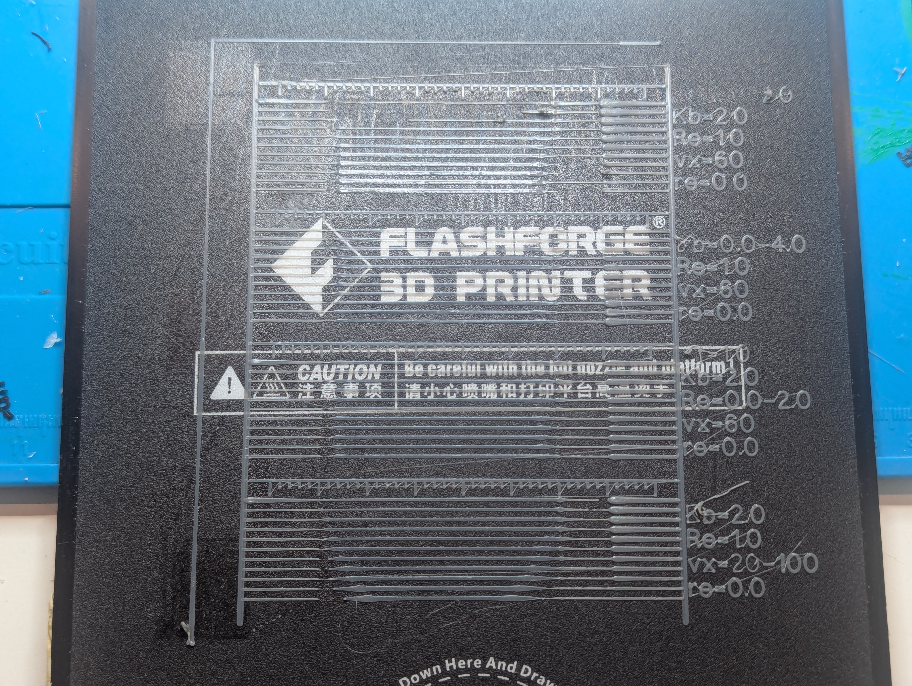
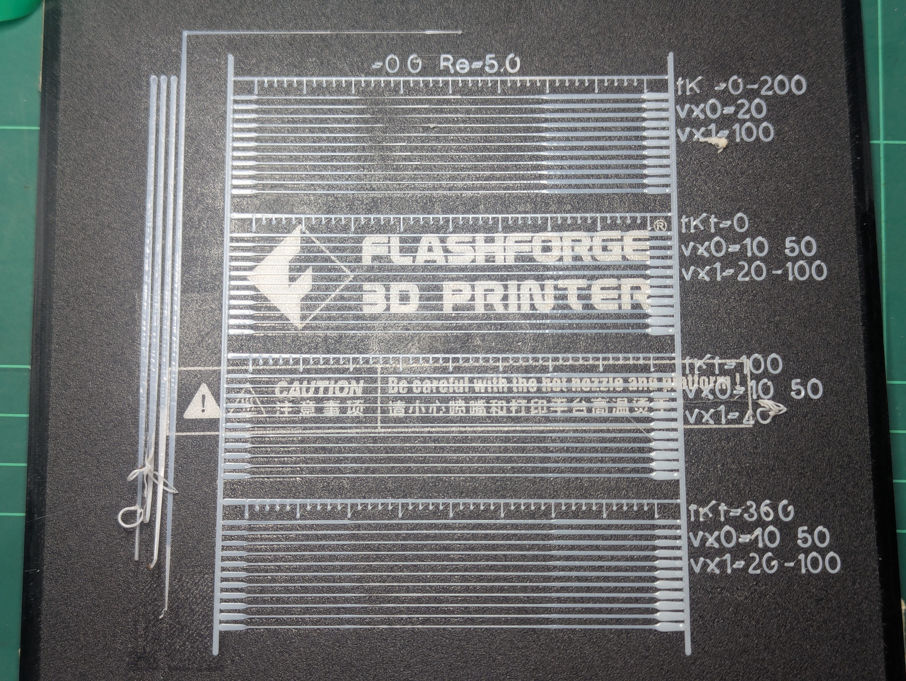
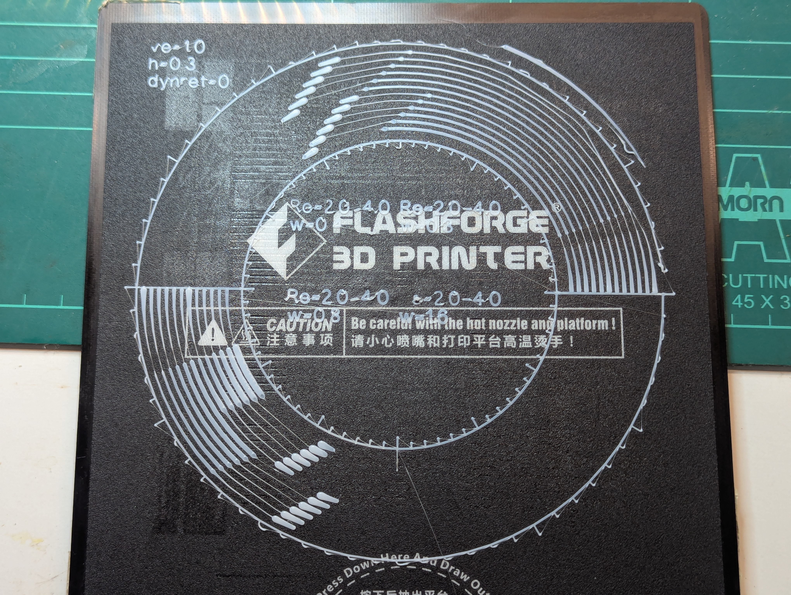

# Pressure Advance Testing

This is a log with lots of (boring) detail of all the different tests done to
try and validate and tune the pressure advance model and supporting code.

## StartStopTest1

This test uses gcode generated by gcodegen.py that estimages accumulated
pressure advance from extrude/move/retract/restore commands assuming a given
Kf value, and scales the retract/restore actions to relieve/preapply the
necessary pressure advance based on the prev/next commands. The printed result
looks like this.


The commented version of gcode output for this is in
[StartStopTest1_Kf1_Re1.g](./StartStopTest1_Kf1_Re1.g).

Each test line has the following sequence (blue markers);

1. draw 5mm@5mm/s - initial extrude to prime the nozzle. Should leave the
nozzle primed with fillament and some small residual pressure.

2. move 10mm@1mm/s - slow move to drain accumulated pressure as drool. Should
leave the nozzle primed with nearly zero residual pressure.

3. draw 50mm@<vx>mm/s - fast draw to see fast line quality.

4. move 10mm@1mm/s - slow move to see if there is any residual pressure drool.

5. draw 15mm@5mm/s - slow draw to see slow line quality after a fast line.

This has the following important transitions (green markers);

1. Stop slow drawing without any retraction. The reduction in speed from 5mm/s
to 1mm/s should see the line get about 5x as wide assuming the printer does no
pressure reduction at the end of drawing (doesn't implement pressure advance
or printer configured with Kf=0).

2. Restore before drawing fast line. This preapplies almost the estimated
pressure required for drawing at the fast line speed. It is slightly reduced
from the full estimated pressure to try and account for the acceleration time.
This will produce an initial blob, but the line should be at the right
thickness after the acceleration is finished (about 3.6mm for 60mm/s, or 10mm
for 100mm/s). If the line is too thin, `Kf` is too low. Too thick, `Kf` is too high.

3. Retract after drawing fast line. There may be a bit of a blob, particularly
for fast draw speeds, from leakage before the retraction is done, but there
should be no drool afterwards. Drool means the pressure was underestimated, so
Kf is too low. No Drool means pressure might have been overestimated, so Kf
might be too high.

4. Restore for drawing slow line after retracting for fast line. This should
show if the end of the fast line over-retracted, with some of the retraction
for relieving pressure actually withdrawing up the nozzle. A thin or missing
start means the fast-line over-retracted so `Kf` should be reduced.

There are 4 different tests (yellow markers) for seeing how things vary with
different parameters. The things varied are the `Kf` values used for estimating
pressure, the vx fast line speed, and the le amount of extra retraction on top
of the pressure relief retraction.

1. See how it varies with Kf. `Kf` goes from 0.0 to 2.0 with each line
increasing by 0.2. vx is 60mm/s and le is 0mm.

2. See how it varies with speed. vx goes from 20mm/s to 100mm/s with each line
increasing by 8mm/s. `Kf` is 1.0 and le is 0.0.

3. Same as 2 except with Kf=1.5.

4. See how it varies with additional retraction. le goes from 0.0mm to 4.0mm
with each line increasing by 0.4mm. `Kf` is 1.0 and vx is 60mm/s.

The results have the following interesting points (red markers).

1. Low `Kf` shows under-restore before fast line as expected.

2. High `Kf` shows over-restore before fast line as expected.

3. Low `Kf` shows under-retract after fast line as expected.

4. High `Kf` shows sufficient retraction for fast line as expected.

5. For the slow line start, low `Kf` shows no sign of the restore even though
drool before it shows there was still residual pressure in the nozzle! This
suggests there must be some backlash, and it is more than the estimated
restore pressure, even for Kf=1.0, which was 0.6339mm!

6. At high `Kf` the slow line doesn't render at all, showing the fast-line
definitely over-retracted, though the backlash would make this appear worse
than it probably is.

7. For a fixed Kf=1.0 the fast line start shows increasing over-restore as
velocity increases. This might be Kf=1.0 is too high and this over-restore
becomes more visible at higher speeds. It could be pressure as a function of
extruder speed is actually sub-linear so `Kf` needs to be reduced at higher
speeds. Move likely it is the blob-during-acceleration artifact because the
line width after acceleration is over is pretty consistent between them all.
This gets much worse at higher velocities because the pressure, restore time,
and acceleration time are all bigger. Note this restore has no retraction
before it, so it would be unaffected by any backlash.

8. For a fixed Kf=1.0 the fast line end shows increasing under-retraction at
lower speeds that almost goes away at higher speeds. This could be that
pressure advance might be non-linear and we need lower `Kf` values at higher
speeds. It could also be there is a constant offset pressure Kc. This would be
a minimum pressure to extrude that is needed to overcome
[friction](https://en.wikipedia.org/wiki/Friction). Note that friction forces
are normally fixed and independent of velocity like this. That this reduces
with higher speeds suggests Kf=1.0 is too high and could be lowered after
adding a Kc offset. Note reducing `Kf` and adding Kc would also improve the
artifacts in point 7.

9. Adding a bit of extra retraction improves both the fast-line
under-retraction in point 8, and the slow-line under-restore in points 5 and 6.
This is because the extra retraction is treated like it sucks up the nozzle
and doesn't relieve pressure on retraction, and needs to be reverted before
pre-applying any pressure on restore, so it's an offset added on both
retraction and restore. If the retraction pressure was actually
underestimated, this additional retract/restore actually relieves/restores the
additional pressure. It also compensates for backlash with the extra
retract/restore distance helping cover the backlash-gap. That the drool goes
away between le=0.8mm and le=1.2mm suggests that there was about 1mm of
combined backlash and vestigial pressure.

All the above suggests the pressure advance and retract/restore models need to
include a Kc pressure offset and Be backlash distance. Note these could be
combined for simple retract/restore pressure advance compensation, but would
need to both be included for accurate output-rate estimates and restore
not-after retract where there is no backlash.

For my Adventurer3 printing with TECOR ASA, we have the following data points;
for vx=60mm/s, ve==4.4901mm/s the minimum amount of total retraction is
between 4.9675 to 5.3675mm, and the right amount of total restore for
vx=5mm/s, ve=0.3742mm/s after that is a bit more than 1.4339 to 1.8339mm.

```
ve0=0.3742mm/s
le0=1.8mm
ve1=4.4901mm/s
le1=5.3mm

Kf*ve1 + Kc + Be = le1 # 1
Kf*ve0 + Kc + Be = le0 # 2
Kf*(ve1-ve0) = le1-le0 # 1 - 2
Kf = (le1 - le0)/(ve1-ve0)
Kf = 0.85
Kc + Be = le1 - Kf*ve1
Kc + Be = 1.5mm
```

So it looks like the following settings would be about right;

* `Kf` = 0.85
* Kc + Be = le = 1.5mm
* Be = 0.6 -> 1.2mm
* Kc = 0.3 -> 0.8mm

## StartStopTest2


The commented version of gcode output for this is in
[StartStopTest2_Kf085_Re15.g](./StartStopTest2_Kf085_Re15.g).

Second test points;

For t1 with Kf=0.5-1.4, vx=60 (@60,ve=3.6037), le=1.5 (note: @5,ve=0.3742):

* The @60 starts all look OK for `0.8 <= Kf <= 1.1`, or `3.1412 <= de <=
4.4709`.

* The @60 ends all look ok for `0.5 <= Kf <= 1.4` or `-3.6438 >= de >=
-7.2955`, but for lines that were not under or over extruded it is `-4.8575 >=
de >= -6.0736`.

* The @5 line start only begins to look OK for` Kf <= 0.5` with @60->@5
`de=-3.6438+1.7984=-1.8454`, but note the previous line was under-extruded so
the drop would need to be higher if the previous line was fully extruded. The
first fully extruded previous line was for `Kf=0.8` and had @60->@5
`de=-4.8575+1.9621=-2.8954` which was too big a drop.

For t2 with Kf=0.5-1.4, vx=100 (@100,ve=7.4835), le=1.5 (note: @5,ve=0.3742):

* The @100 starts all look OK for `0.8 <= Kf <= 1.1`, or `4.8071 <= de <=
6.9831`.

* The @100 ends all look ok for `0.5 <= Kf <= 1.4` or `-4.7648 >= de >=
-10.3905`, but for OK lines it's `-6.6009 >= de >= -8.4811`

* The @5 line start only begins to look OK for` Kf <= 0.5` with @100->@5
`de=-4.7648+1.9267=-2.8381`, but note the previous line was under-extruded so
the drop would need to be higher if the previous line was fully extruded.

For t3 with Kf=0.85 vx=20-100 (@20-@100 ve=1.4967-7.4835), le=-1.5:

* The line starts look OK between `52.0 <= vx <= vx=76.0` or `3.8914 <= ve <=
4.8344`, but are under-extruded for slower speeds and over extruded at higher
speeds.

* The line ends mostly all look OK and look like all lines reached full
extrusion rates by the end, except for slight signs of under-retraction up to
maybe vx=36.0, ve=2.6941.

* the @5 line starts are OKish up to about vx=36.0, ve=2.6941, though the
start dot is not very clearly defined. At higher speeds the @5 line starts to
disappear.

For t4 with Kf=0.85, vx=60 (@60,ve=3.6037), le=0.0-2.0:

* Strangely, the line starts look a little under-extruded for the `1.6 <= le
<= 2.0` retractions, despite them all starting after the same de=3.3621. Are
we getting some extruder slippage when re-extruding previously retracted
fillament? Is the restore speed too high?

* The line ends show signs of under-retraction for `0.0 <= le <= 0.6`, or
`-3.5598 >= de >= -4.1598`.

* The @5 lines are all pretty much non-existent.

If we assume the fast lines starting restore de equals the re pressure for
extruding the line at the required ve, for @60 we have `0.87 <= Kf <= 1.24`
and for @100 `0.64 <= Kf <= 0.93`. This does seem to suggest that either `ve`
is non-linear with `re`, or there is something approximating a `Kc` constant
offset.

Note it can't be a simple as a literal Kc constant offset, since then flow
would decay to zero and stop at that offset, making it equivalent to
over-retraction or backlash. Perhaps this is the "tiny drool" I was seeing
after retractions?

## RetractTest1

This was a rough ad-hock test in the middle of testing if pending code changes
worked or made sense. Appologies to future me for not keeping all the details
better.


This test was run with the default width changed to `w=0.4mm` so the lines are
thinner;

```bash
./gcodegen.py -Kf=0.4 -Kb=2.0 -Cb=0.0 -Re=1.0 -R -P > test.g
```

The verbose commented version of gcode output for this is in
[RetractTest1_Kf04_Kb20_Cb00_Re10_RPv.g](./RetractTest1_Kf04_Kb20_Cb00_Re10_RPv.g)

Note that this does have `-P` pressure advance compensation on, and the `-v`
version of the output shows it has split the draw's into acceleration and
deceleration phases for fast draws with estimates for the pressure at each
stage. I'm also using -Cb=0.0 because it's increasingly obvious that in the
pressure advance calculations this just becomes a fixed offset identical to
having a larger `-Re` because it never "oozes" away according to the model.

This test consisted of the following phases;

* 5mm@5mm/s: warmup draw.
* 40mm@`vx` mm/s: draw to build pressure at the test speed.
* 20mm@`vr` mm/s: move while retracting `re` mm.
* 20mm@`vr` mm/s: move to allow for deceleration.
* 0mm@0mm/s: restore `re` mm at `ve` mm/s.
* 5mm@5mm/s: cooldown draw.

There were three tests done;

1. vx and vr both = 20-100mm/s with re=8mm. The idea was the draw and
retracting move are both at the same speed to minimize acceleration affects
during the transition.

1. vx=20-100mm/s, vr=10mm/s, re=8mm. The idea was to use a slower speed for
the moving retract to get a more accurate read on the amount of retraction
needed.

1. vx=1-10mm/s, vr=1mm/s, re=4mm. This was to try and get a better reading for
very low speeds.

Some observations;

1. In the first 2 tests, the warmup/cooldown 5mm@5mm/s bits are very
over-extruded. These are the slowest parts of those lines suggesting that the
`-R` dynamic restore feature for `-Kf=0.4 -Kb=2.0` is restoring too much for
them, probably underestimating the vestigial pressure after the draw and
assuming the moving retract has more "overretraction" than it really does.

1. For the last test, the warmup 5mm@5mm/s at the start looks fine. Note the
first line is a tiny bit overextruded because of vestigial pressure from the
previous test. However, the cooldown is underextruded and messy, with the
restore clearly being insufficient. This suggests the vestigial pressure from
the draw was over-estimated by `-P`.

1. For the first 2 tests, `-P` broke the draw into a separate acceleration
phase to build pressure which is visible as under-extrusion at the start, that
builds to slight over-extrusion at the end, but is mostly pretty good at
getting the rest of the draw at the right extrusion levels, maybe a little
under for lower speeds and a little over at higher speeds, suggesting maybe
`Kb>2.0` and `Kf<0.4` would be better, but it's pretty damn close. That the
lines are not consistent over the (assumed) linear acceleration suggests
pressure advance really is not linear, and/or the Adv3 doesn't do a good job
of keeping extrusion rates consistent during accelerations.

1. For the 3rd test the slow draws had acceleration distances that were too
small to break into separate phases. The lines mostly look OK except there is
clear over-estrusion at the start of the <3mm/s lines, and some
under-extrusion at the start of the >7mm/s lines. This suggests the criteria
for deciding whether to break apart phases should be not be if the distance
travelled when accelerating is greater than some small threshold (which is
what is currently used), but if the pressure delta is greater than some small
threshold. Both under and over extrusion takes a long time/distance to decay
away.

1. The 1st test shows signs of increasing over-extrusion with increasing `vx`
and `vr` at the transition from the draw to the moving retract. When watching
the print there was a clear slowdown for these transitions despite both `vx`
and `vr` being the same speed. This shows that extruder acceleration is
finite, and the printer compensates for this. The extruder rate cannot
instantly go from +ve to -ve, so the nozzle velocity has to slow down while
the extruder accelerates to keep the extrusion per line consistent. The
over-extrusion is because the pressure advance was too high for the slower
velocity. It might pay to include extruder acceleration limits in the model.

1. The 1st test's retracting move has drool-lengths that increase roughly
linearly with `vx` and `vr`, showing that the pressure advance does increase
with velocity. The lengths go from about 3mm to 5mm, which for `de=-8mm` over
`dx=20mm`, and include the smeared material over that length assuming an
average of about 0.8 extrusion ratio we get the following, or `Pe=1.3` at
20mm/s and `Pe=2.2` at 100mm/s (but note the observation in the next point
that suggests this is an underestimation);
   ```python
   >>> Fd = 1.75
   >>> Fa = pi*(Fd/2)**2
   >>> w, h, r = 0.4, 0.3, 0.8
   >>> (h*w*r/Fa + 8/20) * 3  # for vx=20mm/s
   1.319736486166115
   >>> (h*w*r/Fa + 8/20) * 5  # for vx=100mm/s
   2.199560810276858
   ```
1. The 2nd test's retracting move has drool-lengths that are all almost
exactly the same, regardless of `vx`. However, this test has constant
`vr=10mm/s` and the `-P` option breaks the draw up to include a deceleration
phase, and all the lines decelerate to the same 10mm/s with the same
(estimated) pressure required for that velocity by the end of the draw. That
they all have the same drool length means this deceleration and pressure
reduction phase succeeded at reducing to the same pressure at all velocities.
There is also zero visible artifacts for this deceleration phase suggesting
the `Kf` and `Kb` values are bang-on, which contradicts what we see for the
acceleration phases. It seems there is something harder/slower/different about
increasing pressure vs decreasing it. The drool lengths are all about 5mm for
the large drool, with another tiny tail up to about 10mm. This is about the
same as the `vx=100mm/s` line in the first test, which suggests that for some
reason the pressure at `vx=10mm/s` in this test is the same as at `vx=100mm/s` in
the 1st test. However, there are the following points/observations that might
explain this;
   * the 1st test did actually decelerate for the extruder velocity change at
   the end of the draw, so `vx` was actually less than 100mm/s.
   * the 2nd test drool lines are all at `vr=10mm/s` compared to
   `vr=vx=20-100mm/s` for the 1st test which will make the drool lines thinner
   for the same amount of pressure.
   * there are tiny mess-blobs in the 1st test for most lines at increasing
   distances from about 8mm to 16mm, suggesting the drool and pressure was
   higher than first glance suggests. There are no such blobs for the 2nd test.
I think what happens is at higher speeds the blob-smear is so thin it doesn't
even touch the bed, becoming mostly stringing that sometimes snaps, as the
blob-bead builds up on the nozzle tip. When this blob gets big enough it
touches the bed, flicking off a mess-blob and starting another string. At slow
speeds this doesn't tend to happen, as the bead has enough time to reach the
bed and/or the speeds are slow enough to not snap the strings leaving them to
settle like a thin trail. At slow speeds the thin drool-trail can even suggest
pressure long after it has gone as the previously accumulated bead gets
stretched into a long string. This suggests the real `Pe` values for this and the
previous test are closer to this;
   ```python
   >>> h = 0.5  # low-speed drool was fatter
   >>> (h*w*r/Fa + 8/20) * 5  # for vx=10mm/s in 2nd test
   2.1247255064230366
   >>> h = 0.3  # high-speed drool was thinner
   >>> (h*w*r/Fa + 8/20) * 8  # for vx=vr=20mm/s in 1st test
   3.319736486166115
   >>> (h*w*r/Fa + 8/20) * 16 # for vx=vr=100mm/s in 1st test
   6.63947297233223
   ```
1. The `-P` dynamic pressure model in the output estimates the following
pressures after the draw, but note it also had an extra `Re=1.0` of retraction
to compensate if these were under-estimates. Note the overextruded
warmup/cooldown lines do suggest the model was underestimating pressures.
   * `Pe=1.0025` for vx=10mm/s in 2nd test. Note the second test did go as
   high as `Pe=1.4749` for vx=28mm/s before `-P` started partitioning the draw
   with deceleration phases. This is low compared to what the tests suggest.
   * `Pe=1.2865` for vx=vr=20mm/s in 1st test. This is low compared to the
   `Pe=1.3` and `Pe=3.3` we get from test1 and test2.
   * `Pe=2.7836` for vx=vr=100mm/s in the 1st test. This is a little higher
   than test1's `Pe=2.2`, but much lower than the `Pe=6.6` test2 revised it to.

Thinking about the difference between the acceleration and deceleration phases
with `-P`, and how deceleration looks fine but acceleration looks
under-extruded. The printer will assume ve has to accelerate at the same rate
as vl, giving constant extruder acceleration `ae` for constant nozzle
acceleration `al`. However for a consistent line we need nozzle flow rate `vn`
to match `vl` for a consistent line, and that depends on how far the extruder
`e` is ahead of the nozzle flow `n`. The ideal PA implementation needs to step
`ve` at each change of acceleration. This can't be done cleanly in gcode,
since `ve` will always be a multiple of `vl`. The approximation of just adding
sufficient `de` to acceleration phases for the require pressure change is
pretty good, but it will underextrude particularly at the start of lines. It's
still much better than not doing any pressure advance compensation.

A spreadsheet comparing firmware vs gcode vs no pressure advance is at;

https://docs.google.com/spreadsheets/d/1lqm9OUPRjJmuuPAP1AJQVks3GbTPaaQwL20jl9914gg/edit?usp=sharing

## RetractTest2

This was a more thorough test to see how pressure varied with different
parameters as documented under [#backpressure-testing](#backpressure-testing).


This `gcodegen.py` was changed to have the following defaults for ASA filament;

* -Te=245: Extruder temperature.
* -Tp=100: Platform temperature.
* -Fe=0.0: Extruder fan speed between 0.0 to 1.0.
* -Fc=0.0: Case fan speed between 0.0 to 1.0.
* -Kf=0.4: Linear Advance factor between 0.0 to 4.0 in mm/mm/s.
* -Kb=2.0: Bead backpressure factor between 0.0 to 10.0 in mm/mm.
* -Cb=0.0: Bead backpressure offset between -5.0 to 5.0 in mm.
* -Re=1.0: Retraction distance between 0.0 to 10.0 in mm.
* -Vp=50: Base printing speed in mm/s.
* -Vt=10: Base travel speed in mm/s.
* -Vz=7: Base raise/lower speed in mm/s.
* -Ve=4: Base retract speed in mm/s.
* -Vb=30: Base restore speed in mm/s.
* -Lh=0.3: Layer height `h` in mm.
* -Lw=0.4: Line width `w` in mm.
* -Lr=1.0: Line extrusion ratio `r` between 0.0 to 10.0.

And was run with these arguments;

```bash
./gcodegen.py -Kf=0.4 -Kb=2.0 -Cb=0.0 -Re=1.0 -R -P >RetractTest2_Kf04_Kb30_Cb00_Re10_R.g
```

The verbose commented version of gcode output for this is in
[RetractTest2_Kf04_Kb30_Cb00_Re10_Rv.g](./RetractTest2_Kf04_Kb30_Cb00_Re10_Rv.g)

Note the test phases are;

1. draw 5mm@1mm/s: warmup draw to prime the nozzle.
2. move 10mm@1mm: slow move to drain actual and estimated pressure.
3. restore *default*mm: default restore (Re+Kf/Kb pressure) for next draw.
4. draw 30mm@*vx*: draw to build pressure at tested speed.
5. move 40mm@*vr*: move while retracting *re*mm.
6. restore *re*mm: restore amount retracted during moving retract.
7. draw 5mm@5mm/s: cooldown draw.

Some observations;

1. The really thin layer h=0.1 tests it looks like the nozzle was pressed
  against the bed+glue and barely extruded anything. This suggests actual
  line heights are less than targeted.

1. The 5mm@1mm/s warmup draw looks heavily over-extruded, and it appears to be
  worse for increasing widths and seems unaffected by `vx`, `ve`, or `h`. This
  suggest Kb=3.0 is too high. There is excessive restore before this draw,
  with the verbose gcode saying test1-line1's restore of de=1.9239 to
  pe=0.9172, db=0.26 has vn=0.2377, with the @1mm/s draw only needing
  vn=0.0374, but this high `vn` is an artifact of the restore being fast and
  still oozing afterwards. This large restore is all due to Kb, with
  Pb=Kb*w=3.0*0.3=0.9mm. The line widths are about 3x wider than they should
  be, suggesting Kb=1.0 would be better.
  **UPDATE:** I think the backpressure changes at very very slow 1mm/s speeds.
  At these speeds the nozzle is moving slow enough that heat can conduct
  through to heat the print surface and re-melt the bead, lowering the
  backpressure. I think 5mm/sec is a minimum for the simple "backpressure
  linear with bead-diameter" model to be reliable.

1. The 5mm@5mm/s cooldown draws all look mostly OK, though the thin layers
  struggled a bit.

1. The test 4 draw lines look under-extruded and it was worse as vx increased.
  This suggests Kf=0.4 is too low. The retract lines have l=20 to 30mm or
  Pe=2.0 to 3.0mm for ve=0.4158 to 2.4945mm/s. Note the estimated (and
  probably actually applied and isufficient) pressures were were Pe=1.66 to
  2.35. I'm guessing the old Kf=0.8 would be better?

1. The test 1 retraction lines do show that pressure increased with w, mabye
  linearly with the following values, but it's a bit hard to read and could
  be +-5mm. My impression is the stringing effect makes them look longer than
  they should be. Note for all lines ve=0.3742 giving Pn=Kf*ve=0.15mm, but
  note that Kf=0.4 appears to be an underestimate so it's probably more like
  Kf=0.8 or Pn=0.3. Note this gives roughly dPe=1.5 for dw=0.5, for Kb=3.0,
  but with Cb=0.5 of constant offset. This contradicts the observation in
  point 2 above that Kb=3.0 looks too high for the @1mm/sec warmup lines. I
  suspect this RetractTest approach to measuring pressure is over-estimating
  `Pe` by anywhere between 0.5mm to 1.5mm;

   * w=0.3 l=18mm, Pe=1.8mm, Pb=1.5 (estimated Pe=1.0507, Pb=0.9)
   * w=0.4 l=20mm, Pe=2.0mm, Pb=1.8 (estimated Pe=1.3521, Pb=1.2)
   * w=0.5 l=24mm, Pe=2.4mm, Pb=2.1 (estimated Pe=1.6539, Pb=1.6)
   * w=0.6 l=28mm, Pe=2.8mm, Pb=2.5 (estimated Pe=1.9559, Pb=1.8)
   * w=0.7 l=30mm, Pe=3.0mm, Pb=2.7 (estimated Pe=2.2580, Pb=2.1)
   * w=0.8 l=32mm, Pe=3.2mm, Pb=2.9 (estimated Pe=2.5603, Pb=2.4)

   **UPDATE:** The BacklashTest1 below suggests reasonable values could be around
   Kf=0.4, Kb=4.0, with 0.5mm of backlash, which matches pretty closely with
   these results with backlash explaining the 0.5mm constant offset. Note the
   `l` lengths don't include the line filament, so the Pe balues should be
   higher, which makes this an even better match.

1. The test2 retraction lines do seem to show that pressure was pretty
  constant for constant w. However, looking at the gcode logging suggests
  something was wrong with this test as the `ve` values are different for each
  line. However, looking closer this is an artifact of the logged `ve` being
  for the speed at the end of the line after deceleration. The results are
  about l=35mm or Pe=3.5mm with estimated Pn=0.3, giving Pb=3.2mm compared to
  the estimated. For some reason this is way higher than for test 1. Also note
  the restores were all about 1.8mm and the lines all look OK except maybe a
  bit under-extruded for the faster lines (Kf too low?). Is the line length
  highly variable with bed-adhesion varying with the glue thickness? I suspect
  `Pe` is closer to the restore values of about 1.8mm.

These tests do seem to have mostly validated the theory that backpressure is
just a function of bead diameter (AKA `w`) and independent of `h` and `vx`.
They haven't given us very good data for estimating `Kf` or Kb though. The drool
test for measuring pressure doesn't seem to be very accurate.  It does seem to
show Kf=0.4 is too low and Kb=3.0 is too high.

**UPDATE:** Actually, the only thing suggesting Kb=3.0 is too high was the
1mm/s warmup lines, which probably suffer from the backpressure model not
working for speeds that slow. Possibly Kb=4.0 is a better fit for these results.

Maybe time to just jump to some StartStopTests around the values Kf=0.8, Kb=1.0?

Update: I'd completely forgotten the earlier tests showing there is probably
some backlash. The Cb=0.5 constant offset I was seeing might be 0.5mm of
un-compensated backlash.

## StartStopTest3


The commented version of gcode output for this is in
[StartStopTest3_Kf08_Kb10_Re10_Lh03_Lw05_Rv.g](./StartStopTest3_Kf08_Kb10_Re10_Lh03_Lw05_Rv.g).

### Observations

1. The ruler lines are really messy, particularly when compared to earlier
tests, suggesting the settings `-Kf-0.8 -Kb=1.0
-Re=1.0` are not good. The marker lines are missing their ends. Note their
starts are on the ruler line so they start on top of an existing line with
effectively zero height, but they seem to fail to draw. They get a bit better
after the first test, but note these are drawn after the heavily
over-extruded cooldown draws on the previous test, so they probably have
higher pressures, and instead exhibit some under-retraction and stringing.
The big difference between this and the previous #RetractTest2 that had good
rulers was `Kf` was increased 0.4 to 0.8, and `Kb` was decreased from 2.0 to
1.0. Note these lines are drawn at a very slow 10mm/s, so this overall would
have lowered retract/restore speeds. We can see in the gcode this test used
retract/restore distances of `de=1.9671` compared to `de=2.3919` in
#RetractTest2.


## StartStopTestPLA1

I had to switch fillaments to PLA for a different print, and while it was
there I thought I'd run some of these tests with it.



The commented version of gcode output for this is in
[StartStopTestPLA1_Kf10_Kb20_Re10_RPv.g](./StartStopTestPLA1_Kf10_Kb20_Re10_RPv.g).

And was run with these arguments;

```bash
./gcodegen.py -Te 210 -Tp 50 -Fe 1.0 -Fc 1.0 -Kf 1.0 -Kb 2.0 -Re 1.0 -R -P >StartStopTestPLA1_Kf10_Kb20_Re10_RP.g
```

It's a bit of a mess and mostly shows these settings are not good. In
particular the `-P` support as it's currently implemented has the following
problems;

1. It's incompatible with the StartStopTest which includes a slow moving
  restore at the end to try and determine the amount of over-retraction.
  Dynamic extrusion interprets as a literal draw request that needs
  significant Pe adjustment, which messes it up.

1. There is significant over-extrusion at the end-of-acceleration and
  start-of-deceleration transition, and under-extrusion at the start of
  acceleration and end of deceleration phases. Part of this is because dynamic
  extrusion in gcode aproximates the ideal firmware solution, but I think the
  worst of it is because the model used doesn't include extruder acceleration
  limits. I believe the extreme extruder velocity changes at these transitions
  make the printer slow down the nozzle to match the extruder speed while it
  accelerates at it's limits. This slowdown while Pe is high causes the
  overextrusion.

## StartStopTestPLA2

This was a quick attempt to do the previous test again with `-P` turned off
and retraction turned up a bit to try and reduce the stringing.


The commented version of gcode output for this is in
[StartStopTestPLA2_Kf10_Kb20_Re15_RPv.g](./StartStopTestPLA2_Kf10_Kb20_Re15_RPv.g).

```bash
./gcodegen.py -Te 210 -Tp 50 -Fe 1.0 -Fc 1.0 -Kf 1.0 -Kb 2.0 -Re 1.5 -R >StartStopTestPLA2_Kf10_Kb20_Re15_R.g
```

There is still a lot of stringing. The retract and slo restore at the end seem
to show nearly zero difference between any of the tests. There is long
stringing with nearly zero sign the slow restore did anything. The only test
that maybe shows the slow restore kicking in is the first two lines of the
first test, with Kf=0.0 and Kf=0.2. I believe this is largely that the Re=1.5
means a big retraction that simply cannot be slow retored at this tests
restore rate. We only restore 1.5mm in the slow restore which only covers the
Re=1.5mm, so we only see the slow restore start to make a differene if the
retraction amount needed was over-estimated.

## BacklashTest1

This tested retract and restore distances for different speeds. It has the
following phases;

* 0mm: default drop and restore to pre-apply pressure before draw.
* 45mm: draw at <vx>mm/s to stabilize pressure at that speed.
* 20mm: moving retract of <re>mm at 5mm/s to measure required retraction.
* 20mm: moving restore of <re>mm at 5mm/s to measure required restore.
* 5mm: draw at 5mm to finalize line and stabilize pressure.
* 0mm: default retract and raise to relieve any vestigial pressure.


```bash
./gcodegen.py -Kf=0.5 -Kb=2.0 -Re=1.5 -Lh=0.3 -Lw=0.5 -R >BacklashTest1_Kf05_Kb20_Re15_Lh03_Lw05_R.g
```


The commented version of gcode output for this is in
[BacklashTest1_Kf05_Kb20_Re15_Lh03_Lw05_Rv.g](./BacklashTest1_Kf05_Kb20_Re15_Lh03_Lw05_Rv.g).

### Observations

All the lines are beautifully consistent at all speeds, with clean starts and
ends, suggesting Kf=0.5, Kb=2.0, Re=1.0 is pretty close to optimal. There are
some mild signs of bubbling, suggesting the filament is starting to get a bit
wet (it's being left on the spool holder unprotected).

Doing the retract/restore 5mm over 20mm distance is de=0.25mm per 1mm of line.
The lines themselves also consume filament that would normally have to be
retracted, and start with a blob about 2mm wide and taper away roughly
linearly to nothing. Assuming the average width is 1mm, this gives a line
volume of `h*w/Fa=0.125mm` of filament per mm of line.

The difference between the retraction distance with no line and the restore
distance with no line is the backlash `Be`. As there is no extruded line for these
distances there is no line-volume compensation needed. This distance is the
same as the difference between the retract line length and restore line
length.

So the required retraction distance and backlash is;

```python
# lr is the retract line length
# lb is the restore line length

le = lr * h * w / Fa      # retract-line volume in filament length.
   = lr * 0.3 * 1.0 / Fa
   = lr * 0.125

re = lr * 5 / 20          # retract distance.
   = lr * 0.25

Re = le + re              # total retract distance needed.
   = l * 0.25 + l * 0.125
   = l * 0.375

Be = (lr - lb) * 0.25     # extruder backlash distance.
```

From the test results, measuring lengths for 20mm/s, 60mm/s, and 100mm/s we get;

| vx     | lr    | lb   | Re    | Be     |
| ------ | ----- | ---- | ----- | ------ |
| 20mm/s |  10mm |  8mm | 3.8mm | 0.50mm |
| 60mm/s |  13mm | 11mm | 4.9mm | 0.50mm |
|100mm/s |  16mm | 13mm | 6.0mm | 0.75mm |

Note the measurements are pretty rough and are all about +-2mm because its
hard to determine exactly when the retract lines end. The restore lines all
have a little blob at the start, caused by the slow bead buildup before it
touches the bed. In general the lines all seem to increase roughly linearly
with velocity `vx`. The `Re` retract distances all seem to roughly match
earlier experience. The `Be` backlash distances are very rough and about
+-0.25, but do seem to correspond roughly with what was observed in earlier
tests.

In theory, `Re - Be = Pe` for the corresponding speeds. However, looking at
the test gcode logging we can see the "retraction Pe" `rPe` (assuming
`Be=0.6`) is much higher than the restored pressures `dpe` before drawing the
lines. This is partly because the restored pressure uses the average velocity
of the line including acceleration/deceleration, which is less than `vx`.
However, even the model pressure `mPe` for the target `vx` velocity is less.

| vx     | ve    | rPe   | dpe   | mPe   |
| ------ | ----- |------ | ----- | ----- |
| 20mm/s | 1.2mm | 3.2mm | 1.6mm | 1.6mm |
| 60mm/s | 3.7mm | 4.3mm | 2.6mm | 2.9mm |
|100mm/s | 6.2mm | 5.4mm | 3.2mm | 4.1mm |

This suggests our `Kf=0.5` and `Kb=2.0` are too low, and should be higher. If you compare
calculating Kf and Kb for the different speeds it suggests `Kf=0.44` and
`Kb=5.3` would be better;

```python
def calc(pe0,ve0,pe1,ve1,w=0.5):
  dpe,dve=pe1-pe0,ve1-ve0
  Kf=dpe/dve
  Kb=(pe1-Kf*ve1)/w
  return Kf,Kb

>>> calc(5.4,6.2,4.3,3.7)
(0.4400000000000002, 5.343999999999998)
>>> calc(4.3,3.7,3.2,1.2)
(0.43999999999999984, 5.344000000000001)
>>> calc(5.4,6.2,3.2,1.2)
(0.44000000000000006, 5.344)
```

This contradicts the nice looking lines at all speeds we were getting for
`Kf=0.5`, `Kb=2.0`. One thing I noticed is the lines appear a bit thicker than
0.5mm, more like 0.7mm. This suggests the bed leveling might be a bit off and
the layer thickness is actually less. If we use `w=0.7` we get;

```python
>>> calc(5.4,6.2,3.2,1.2,w=0.7)
(0.44000000000000006, 3.8171428571428576)
```

If we also assume our very rough backlash measurment is off and it's actually
closer to 0.8 we get;

```python
>>> calc(5.2,6.2,3.0,1.2,w=0.7)
(0.44000000000000006, 3.5314285714285716)
```

Note that the nice ruler was actually drawn using `Re=1.5` at speed
`v=10mm/s`, giving retract/restore distances of about `de=2.8`. This meant it
had extra retract/restore distance to "normalize" the pressure with. There are
tiny hints of stringing suggesting it was right on the edge of the right
amount of retraction. After compensating for backlash it was releaving up to
`de-Be=2.8-0.6=2.2mm` of pressure. For `Pe=2.2mm` and `Kf=0.44`, then
`Kb*w=1.9`, sugggesting `Kb=3.8` for `w=0.5` or `Kb=2.7` for `w=0.7`. This is
closer to the retraction experimental results, but still a bit lower.

As a rough compromise between all of this, and erring on the side of less
pressure compensation with more `Re` to normalize and compensate for the
errors, I think I'm going to use `Kf=0.4, Kb=4.0, Re=1.0`.

## BacklashTest2

Doing some prints using `conv-gcode.py -Kf=0.4 -Kb=2.0 -Re=3.0` as a
post-processor for FlashPrint, I noticed that the initial line after the
pre-extrude was very under-extruded. This appears to be caused by excessive
retraction after the pre-extrude, which uses a draw @20mm/sec of a line with
`l=0.20x0.40x4.16`, which is 4.16 times over-extruded for a bead diameter of
about 1.66mm and ve=2.77mm/s. This gives an estimated pressure for `Kf=0.4
Kb=2.0` of `Pe=Pn+Pb=1.1+3.3=4.4`, which must be be too high. Note
over-extrusion this high are not typical and creates a bead that flows past
the edge of the nozzle and bulges up around it. This almost certainly will
have pressure characteristics that defy any simple "pressure linearly
proportional to bead diameter" model, but we still need to figure out how it
behaves so we can get roughly correct retractions after the pre-extrude.

The previous backlash test showed promise as a way of measuring this, but had
a few faults. Things that were changed;

1. Reinstate the initial priming draw 5mm@1mm, move 10mm@1mm always with h=0.3
   to ensure the nozzle is consistently primed or at least show how close the
   initial pressures are.

2. Always do the final cooldown draw 5mm@1mm with h=0.3 for consistency. Also
   do an up and dn action before it to preset the pressure and cancel any
   backlash.

3. Do the moving retract and restore @10mm/sec with h=0.2 to get a more
   accurate measure of when the flow stops to measure the pressure.

The test phases are now;

* 0mm: dn and restore to h=0.3.
* 5mm@1mm/s: draw to prime nozzle.
* 10mm@1mm/s: move to drain nozzle.
* 0mm: dn and restore to test height `h=h` with pre-applied pressure.
* 30mm@vx: draw to stabilize pressure at that speed.
* 0mm: move to h=0.2mm for start of pressure measurement.
* 20mm@10mm/s: moving retract `de=-re` to measure required retract.
* 20mm@10mm/s: moving restore `de=re` to measure required restore.
* 0mm: default retract and up then dn and restore to h=0.3mm.
* 5mm@1mm/s: cooldown draw to finalize line and stabilize pressure.
* 0mm: default retract and up.

The tests were run with;

* common args: Kf=0.6, Kb=3.0, Re=2.5
* test1: ve=1.0, h=0.3, w=(0.3,0.8), re=4.0
* test2: ve=1.0, h=0.3, w=(0.8,1.8), re=4.0
* test3: ve=1.0, h=0.2, w=(0.3,0.8), re=4.0
* test4: ve=1.0, h=0.2, w=(0.8,1.8), re=4.0

The cmdline run was;

```bash
./gcodegen.py -Fe=0.0 -Kf=0.6 -Kb=3.0 -Re=2.5 -R -V -E -v >BacklashTest2_Fe00Kf06Kb30Re25RVEv.g
```


The commented version of gcode output for this is in
[BacklashTest2_Fe00Kf06Kb30Re25RVEv.g](./BacklashTest2_Fe00Kf06Kb30Re25RVEv.g).

### Observations

The first warmup 5mm@1mm/s l=0.3x0.5x1.0 line for each test is rather
over-extruded, but they get better after that. The first line is the first
thing drawn after drawing the ruler and writing the summary text, which is all
done @10mm/s with l=0.3x0.5x1.0 lines, looks good, and has lots of time to
stabilize to the right pressure for that speed and line. The only difference
between the ruler and summary and the warmup line is the print speed, so the
only thing giving different pressure is `Kf`. I'd noticed this in earlier
attempts at this test and had increased `Kf` from 0.4 to 0.6 which made it
better, but it looks like it still needs to be higher. Note that this assumes
`Kf` is linear, which it might not be, so it's possible this only applies for
the transition from @10mm/s to @1mm/s, and needs to be different for higher
speeds. Earlier attempts also had over and under extrusion problems which lead
to using `Kb=3.0` for this test, which seems pretty close.

The other warmup lines are all also a bit over-extruded, except for the very
last line of test4. The next 10mm@1mm/s drain move all look pretty consistent
and appear to get the pressure down to roughly the same and low for all tests.

The 5mm@1mm/s l=0.3x0.5x1.0 cooldown lines are all even more over-extruded
except for the last lines of test4. Note that the warmup lines are done
immediately after the previous cooldown line with exactly the same speed and
line settings, so the warmup over-extrusion is just a continuation of the
cooldown over-extrusion, which must come from the restore after the
retract/restore measurement lines are done.

The test4 results are different from the others, with the over-extrusion for
the warmup/cooldown lines slowly fading with each test line. I measured the
scraped-off line thicknesses and for test1, test2, and test3 the 0.3mm thick
test-edge brim lines measured as 0.25mm thick, but for test4 they measured as
0.30. So the test4 improvement is probably at least partially a bed-leveling
artifact. The test1-3 5mm@1mm/s warmup/cooldown lines are more over-extruded
than the same l=0.3x0.5x1.0 but @10mm/s ruler, brim, and text lines because
the faster lines had time to stabilize, but the warmup/cooldown lines didn't
and had the excess accumulated pressure from the thinner than estimated test
lines, retained by the retract/restore operations, and exagerated by the slow
@1mm speeds.

For lines thicker than about 0.9 the test lines don't necessarily get wider,
but they do get thicker, showing that the bead doesn't get wider, but it
starts to bulge up around the nozzle.

The test1 test lines start a little under-extruded, particularly for the
thinner lines. In test2 the line starts seem to get a little over-extruded for
the thickest lines. For test3 and test4 we see the same under-extruded for
thin, over-extruded for thick thing, but maybe less visible.  The test line
ends all look good, so the pressure did stabilize well, so the the
retract/restore measurements should all be good.

The retraction measurement lines all look about the same, with shorter lines
looking exactly like the ends of the longer lines. They all start at about
0.5mm wide and taper away nicely, making their volume about lx0.2x0.25xFa or
0.02mm per mm of length, which added to the `4/20 = 0.2mm` retracted per mm
gives 0.22mm of pressure relieved per mm of line.

Sadly, for lines with w>0.7 re=4.0 is not enough retraction to get a final
retraction measurement. I need to do this again with a larger `re=6.0` value.

## BacklashTest3

I attempted to modify BacklashTest2 to do additional retraction so we could
see the retraction required for the wider lines. It added an optional `r0`
initial retraction to apply that would be executed over the first 1mm of the
moving retract. The results are WTF!


I'm not going to bother including details.

### Observations

This contradicts the BacklashTests2 results so much it throws into question
the whole testing methodology. The test1 retraction results kind of match for
the first couple of lines, but then the lines start to look exactly the same
even though they have effectively and extra 1mm of retraction. The other tests
are an ambiguous mess but mostly look like the lines are exactly the same
length as for BacklashTest2. For test2 the retraction lines a smeared so thin
they are barely readable, and for test4 they look like stringing that barely
touched the bed.

I think this test is heavily influenced by how well the bed is leveled and
largely measures how far the bead at the end of the drawn line can be smeared
or stringed. In between BacklashTest2 and BacklashTest3 I attempted to level
the bed and it looks like I made it worse.

So back to the drawing board, and throw out all the results and assumptions so
far.

## fKfTest1

After a bit of a break I'm back to trying to finalize the calibration of this.
I'm using white PLA because it's easier to see.

This test was because I'd never completely proven that the Flashforge
Adventurer3 doesn't support pressure advance. There was a chance it did but it
supported the original version where Kf was in steps advance per mm/s instead
of mm advance per mm/s. In that case I wouldn't have seen it because it
requires values in the range 30 to 150 instead of 0.1 to 2.0. It's also
possible that it executes the M900 command like the fan-speed settings that
execute at parse-time and are not put into the execution queue. In that case
my old attempts to claibrate Kf would have failed because likely all the test
lines just would have used the last Kf setting.

So this test checks if setting Kf as high as 200 makes any visible changes,
both per-line within a single print, and per print.

Each of the 4 test cases were executed as completely separate prints. Each
test does;

1. Tests speed transitions between 20mm/s to 100mm/s with different fKf
  "firmware Kf" settings from 0-200. This should show differences between each
  line if PA does with old-style values. It could fail to show any difference
  if Kf settings changes are not executed "in-line' though.

2. Test speed transitions to and from 2x the speed, starting with slow speeds
   between 10mm/s to 50mm/s with fKf=0 for the whole print as a baseline.

3. Test speed transitions to and from 2x the speed, starting with slow speeds
   between 10mm/s to 50mm/s with fKf=100 for the whole print.

4. Test speed transitions to and from 2x the speed, starting with slow speeds
   between 10mm/s to 50mm/s with fKf=200 for the whole print.

The results were;



The commented version of gcode output for this is in

* [fKfTest1_Te210Tp50Fe10Fc10Kf00Kb00Re50n0v.g](./fKfTest1_Te210Tp50Fe10Fc10Kf00Kb00Re50n0v.g).
* [fKfTest1_Te210Tp50Fe10Fc10Kf00Kb00Re50n1v.g](./fKfTest1_Te210Tp50Fe10Fc10Kf00Kb00Re50n1v.g).
* [fKfTest1_Te210Tp50Fe10Fc10Kf00Kb00Re50n2v.g](./fKfTest1_Te210Tp50Fe10Fc10Kf00Kb00Re50n2v.g).
* [fKfTest1_Te210Tp50Fe10Fc10Kf00Kb00Re50n3v.g](./fKfTest1_Te210Tp50Fe10Fc10Kf00Kb00Re50n3v.g).

### Observations

There is no significant difference between any of the lines in any test.
Setting Kf to these values doesn't make any difference.

## fKfTest2

This was exacty the same as fKfTest1 except using fKf values in the range 0.0
to 2.0.

The results were;


The commented version of gcode output for this is in

* [fKfTest2_Te210Tp50Fe10Fc10Kf00Kb00Re50n0v.g](./fKfTest2_Te210Tp50Fe10Fc10Kf00Kb00Re50n0v.g).
* [fKfTest2_Te210Tp50Fe10Fc10Kf00Kb00Re50n1v.g](./fKfTest2_Te210Tp50Fe10Fc10Kf00Kb00Re50n1v.g).
* [fKfTest2_Te210Tp50Fe10Fc10Kf00Kb00Re50n2v.g](./fKfTest2_Te210Tp50Fe10Fc10Kf00Kb00Re50n2v.g).
* [fKfTest2_Te210Tp50Fe10Fc10Kf00Kb00Re50n3v.g](./fKfTest2_Te210Tp50Fe10Fc10Kf00Kb00Re50n2v.g).

### Observations

Again, no difference between any of the lines. It seems the Adv3 really
doesn't support PA. Theory confirmed.

## BacklashTest4

Here I go back to trying to validate/calibrate the model. I've largely
forgotten all the lessons learned by now, but it largely seemed to defy
logic so a fresh slate is probably good.

There are a few thoughts that modified my direction a bit.

1. Drool is gonna drool, no matter how much retraction you apply. Over
   retracting sucks air up the middle of the nozzle, the molten fillament
   stuck to the sides drools down to the end, and then the inhaled air starts
   to warm up and expand, pushing it out the nozzle. Even for a "perfect"
   retraction that only relieves the pressure, I suspect the heat-creep up the
   fillament causes expansion that pushes out more drool. I believe this is
   why latest dual-head Bamboo labs printer has a mechanical "nozzle blocker"
   for the unused nozzle; because it is the only way to prevent drool
   completely.

2. This means measuring zero pressure by looking for when drool stops is
   pointless. Speeds of 1mm/s are always going to leave a line. The best we
   can do is something like define zero-pressure as no line at h=0.2mm
   vx=10mm/s.

3. Bed leveling deviations completely mess with attempts to consistently
   measure extrusion widths. Maybe we need to do a filled in first layer to
   test on top of.

This test revived the previous backlash test and tidied it up a little bit.
The test phases are now;

* 0mm: hopdn and restore to h=0.2.
* 5mm: draw at 5mm/s to prime nozzle.
* 10mm: move at 1mm/s to drain nozzle.
* 0mm: hopdn and restore to h=h.
* 30mm: draw at `<vx>`mm/s to stabilize pressure at that speed.
* 0mm: move to h=0.2mm for start of pressure measurement.
* 0mm: retract initial de=re0.
* 20mm: moving retract of `<re>`mm at 10mm/s to measure required retract.
* 0mm: restore initial de=re0.
* 20mm: moving restore of `<re>`mm at 10mm/s to measure required restore.
* 0mm: default retract and hopup, then hopdn and restore to h=0.2mm to remove backlash.
* 5mm: draw at 5mm/s to finalize line and stabilize pressure.
* 0mm: default retract and hopup to relieve any vestigial pressure.

The tests were run with;

* common args: Kf=0.0, Kb=0.0, Re=4.0
* test1: ve=1.0, h=0.3, w=(0.3,0.8), r0=0.0, re=4.0
* test2: ve=1.0, h=0.3, w=(0.8,1.6), r0=2.0, re=4.0
* test3: ve=1.0, h=0.2, w=(0.3,0.8), r0=0.0, re=4.0
* test4: ve=1.0, h=0.2, w=(0.8,1.6), r0=2.0, re=4.0

The results were;


The commented version of gcode output for this is in
[BacklashTest4_Te210Tp50Fe10Fc10Kf00Kb00Re40v.g](./BacklashTest4_Te210Tp50Fe10Fc10Kf00Kb00Re40v.g).

### Observations

None of the lines got anywhere near stabilized at their target size before the
retraction measurment phases started. This renders the retraction measurements
pretty useless. This is because the Kf=Kb=0.0 settings meant zero restores
before starting them, and 30mm is just not long enough for the extrusion rate
to stabilize without an initial injection of pressure.

This test is one of the questionable "drool" based tests, but I think it still
might be useful with the right Kf and Kb settings. I was originally hoping
that this could give me a fresh baseline for the Kb setting, but it didn't.

Interestingly the first test does seem to clearly show the backlash
as around 0.5 to 1mm.

I'll need to have a think about what the next test should be...


### SpStartStopTest1

The problem is the line lengths used in the previous tests are too short for
the pressure to stablize. We need longer lines, so a spiral test is better.
The spiral coordinates used are R (radius) and C (number of revolutions).
Additionally the spirals move inward by dRdC=2mm per revolution. Line lengths
can be specified in mm (dl), circles "C" (dC), or seconds (dt).

This test is similar to the old StartStopTest but in a spiral for longer line
lengths. The test phases are;

* warmup
  * 0mm: hopdn and restore with `de=1.0`.
  * 4/72C: draw at 5mm/s to prime nozzle.
  * 4/72C: move at 5mm/s to drain nozzle.
* test
  * 0mm: restore with `de=<Re>` to apply pressure.
  * 3s: draw with `de=<ve>,h=<h>,w=<w>,r=1` to check line quality.
  * 0mm: retract with `de=-<Re>` to relieve pressure.
  * 20mm: move at `vl=5mm/s` to check for sufficient retraction.
  * 0mm: restore pressure with `de=<Re>` to what it was before retracting.
* cooldown
  * 5mm: draw at 5mm/s to finalize line and stabilize pressure.
  * 0mm: retract and hopup with `de=-1mm`.

The objective is to find the ideal retraction and restore distances for
ve=1.0mm, h=0.3 with different w values.

The tests were run with the cmdline;

```bash
$ ./gcodetest.py -Te=210 -Tp=50 -Fe=1.0 -Fc=1.0 -Kf=1.0 -Kb=1.0 -Re=1.0 -R >test.g
```

Note this turns on dynamic retraction with `Kf=1.0 Kb=1.0 Re=1.0` which is
used to draw the dial ruler and test text, but those settings are overridden
for the testlines to turn of dynamic retraction while keeping the Kf and Kb
settings so that the generated logging can show the estimated pressures for
those settings without changing anything. The test args were;

* common args: ve=1.0, h=0.3, dynret=False
* test1: Re=(0.0,5.0), w=0.3
* test2: Re=(0.0,5.0), w=0.4
* test3: Re=(0.0,5.0), w=0.8
* test4: Re=(0.0,5.0), w=1.6

The results were;


The commented version of gcode output for this is in
[SpStartStopTest1_Te210Tp50Fe10Fc10Kf10Kb10Re10Rv.g](./SpStartStopTest1_Te210Tp50Fe10Fc10Kf10Kb10Re10Rv.g).

### Observations

The Kf=1.0,Kb=1.0,Re=1.0 settings are rather wrong as the dial and text is
under-extruded with poor bed adhesian and under retracted with stringing.
Interestingly it appears to have got worse as it went around the dial drawing
the 'ticks', I believe this is because gcodegen.py had a `P=0.8` scaledown on
the target restore pressure to try and reduce oscillations when playing with
dynamic extrusion adjustments. However this means it's sacrificing 20% of the
pressure every retract-restore cycle, so I'm going to remove this when dynamic
extraction is off.

The pre-extrusion pressure and retraction was overestimated resulting in the
first text after that failing to print until the second line.

The tests largely succeeded at narrowing down the ideal retract and restore
distances. For all widths the ideal restore is near 3.0, and the ideal
retraction is somewhere below 4.0. the resolution is not fine enough to
identify any differences between widths, but there is maybe a hint that wider
widths do need slightly higher pressures.

## SpStartStopTest2

Trying again with a slightly tweaked version of the test and narrowing in on
the retraction distances around 3.0mm. I've fixed the dynamic retraction not
use the 0.8 scaling if dynamic extrusion is off. I've extended the time and
reduced the distance of the warmup and cooldown phases by moving at 1mms for
most of it. I changed the initial hopdn restore and final hopup retract to use
`pe=` target pressure instead of `de=` extruder distance so that it attempts
to compensate/cancle accumulated pressure as estimated by the current Kf/Kb
settings.

* warmup
  * 0mm: hopdn and restore to `pe=1.0`.
  * 1/72C: draw at 1mm/s to prime nozzle.
  * 2/72C: move at 1mm/s to drain nozzle.
  * 1/72C: move at 5mm/s to check nozzle pressure.
* test
  * 0mm: restore with `de=<Re>` to apply pressure.
  * 3s: draw at `de=<ve>,w=<w>` check line quality.
  * 0mm: retract with `de=-<Re>` to relieve pressure.
  * 20mm: move at `vl=5mm/s` to see if there is drool.
  * 0mm: restore pressure with `de=<Re>` to what it was before retracting.
* cooldown
  * 5mm: draw at 5mm/s to finalize line and stabilize pressure.
  * 0mm: retract and hopup with `pe=-1.5mm`.

The tests were run with the cmdline;

```bash
$ ./gcodetest.py -Te=210 -Tp=50 -Fe=1.0 -Fc=1.0 -Kf=0.4 -Kb=1.0 -Re=1.5 -R >test.g
```

* common args: ve=1.0, h=0.3, dynret=False
* test1: Re=(2.0,4.0), w=0.3
* test2: Re=(2.0,4.0), w=0.4
* test3: Re=(2.0,4.0), w=0.8
* test4: Re=(2.0,4.0), w=1.6

The results were;


The commented version of gcode output for this is in
[SpStartStopTest1_Te210Tp50Fe10Fc10Kf10Kb10Re10Rv.g](./SpStartStopTest1_Te210Tp50Fe10Fc10Kf10Kb10Re10Rv.g).

The results were;



The commented version of gcode output for this is in
[SpStartStopTest2_Te210Tp50Fe10Fc10Kf04Kb10Re15Rv.g](./SpStartStopTest2_Te210Tp50Fe10Fc10Kf04Kb10Re15Rv.g).

### Observations.

The starting text is a little better but still seems to suffer from the
pre-extrude pressure being over-estimated and over-retracted. The dial is
still terrible and appears to still get worse as it went around adding ticks.
Looking at the output logging it looks like the pressure model is oscilating,
but not sure why.

The test seem to generally show what was expected.

There does appear to be a pattern that lines that start under-restored do
increase in width as they go, but lines that start over-restored seem to not
decrease in width, or at least not as quickly. It seems it's easier to
increase a low pressure than it is to shed a high pressure.
